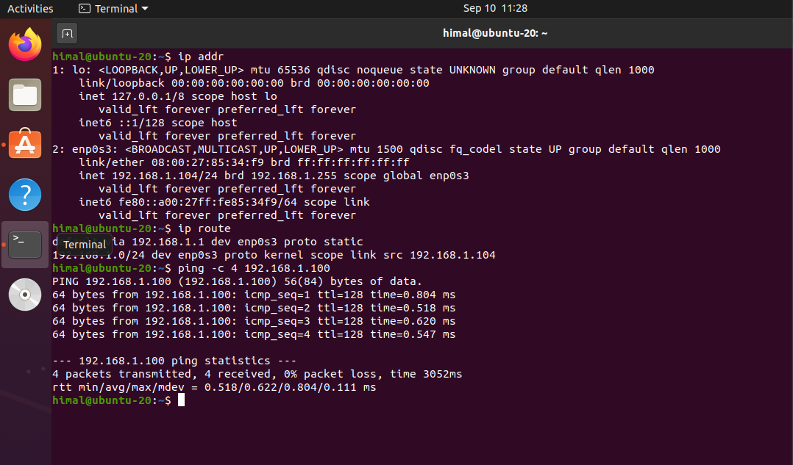
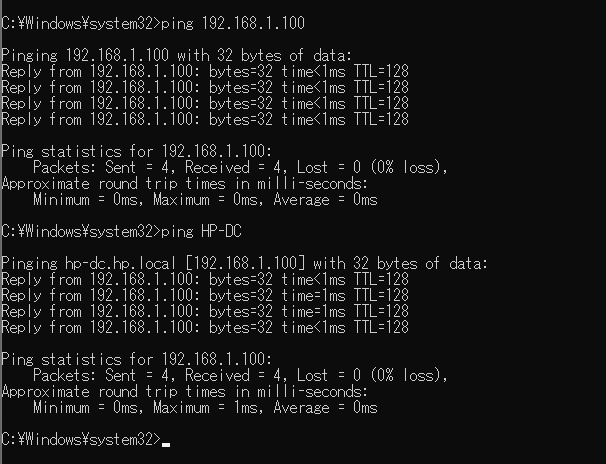

# Lab 1 – Virtual Network and Windows Server Environment

## Overview

This lab focused on building the virtual infrastructure used throughout the ICT279 Security Administration labs.

The environment consists of three virtual machines connected through a VirtualBox NAT Network. The purpose was to establish reliable communication between the systems and prepare the environment for later work involving Active Directory, authentication, access control and Group Policy.

## Lab Environment

| System | Role | IPv4 Address |
|---|---|---|
| Windows Server | Server / later Domain Controller and DNS Server | `192.168.1.100` |
| Windows 10 | Windows client | `192.168.1.101` |
| Ubuntu Linux | Linux client | `192.168.1.104` |

Network: `192.168.1.0/24`

Default Gateway: `192.168.1.1`

## Objectives

The main objectives of this lab were to:

- Build a multi-machine virtual lab environment.
- Configure VirtualBox networking.
- Assign static IPv4 addresses.
- Configure the default gateway and DNS settings.
- Establish communication between the virtual machines.
- Verify connectivity using network diagnostic tools.
- Prepare the environment for later security administration labs.

## Implementation

### 1. Virtual Network Configuration

The virtual machines were connected to the same VirtualBox NAT Network so they could communicate with each other within the lab environment.

During the initial setup, the network adapters had to be configured correctly before communication between the virtual machines was possible.

### 2. Windows Server Configuration

The Windows Server was configured with:

- IP address: `192.168.1.100`
- Subnet mask: `255.255.255.0`
- Default gateway: `192.168.1.1`

A static IPv4 address was used because server services need a predictable network address that client systems can reliably reach.

#### Verification

The configuration was verified using:

```powershell
ipconfig /all
```

The output confirmed that the server was using `192.168.1.100/24` with `192.168.1.1` as its default gateway.

The screenshot was captured after later Active Directory configuration had been completed, which is why the server also shows the `HP.local` domain configuration.


### 3. Windows 10 Client Configuration

The Windows 10 client was configured with:

- IP address: `192.168.1.101`
- Subnet mask: `255.255.255.0`
- Default gateway: `192.168.1.1`
- Preferred DNS server: `192.168.1.100`

The Windows Server was configured as the client's preferred DNS server in preparation for the Active Directory environment used in later labs.

#### Verification

The client configuration was verified using:

```powershell
ipconfig /all
```

The output confirmed the static IPv4 configuration and showed that the client was using `192.168.1.100` as its DNS server.

The screenshot was captured after later domain configuration had been completed, which is why the client also shows the `HP.local` domain.


### 4. Ubuntu Client Configuration

The Ubuntu virtual machine was connected to the same virtual network and configured with:

- IP address: `192.168.1.104/24`
- Default gateway: `192.168.1.1`

The network configuration and routing table were inspected using:

```bash
ip addr
ip route
```

Connectivity to the Windows Server was tested using:

```bash
ping -c 4 192.168.1.100
```

All four packets were received with `0%` packet loss, confirming successful communication between the Ubuntu client and Windows Server.



## Connectivity Verification

Communication between the Windows 10 client and Windows Server was tested using the server's IPv4 address:

```powershell
ping 192.168.1.100
```

All four requests received replies with `0%` packet loss, confirming IP connectivity between the systems.

Name resolution was also tested using:

```powershell
ping HP-DC
```

The hostname successfully resolved to `192.168.1.100`, and all four requests received replies.

The hostname test reflects the current lab environment after DNS and Active Directory configuration completed in later labs. The underlying IP connectivity was originally established during Lab 1.



## Troubleshooting

### Destination Host Unreachable

During the initial network setup, communication between the virtual machines returned a `Destination Host Unreachable` message.

I checked the network configuration and found that the virtual machines needed to be connected to the same VirtualBox NAT Network.

After correcting the VirtualBox network configuration, I tested the connection again using `ping` and successfully established communication between the systems.

This demonstrated that correct IP addressing alone is not enough. The virtual network adapters must also be connected to the appropriate virtual network for communication to occur.

## Key Learning Outcomes

Through this lab I gained practical experience with:

- Creating a multi-machine virtual lab environment.
- Configuring VirtualBox networking.
- Assigning static IPv4 addresses.
- Understanding the `192.168.1.0/24` subnet.
- Configuring default gateways and DNS settings.
- Using `ipconfig`, `ip addr` and `ip route` to inspect network configuration.
- Using `ping` to verify communication between Windows and Linux systems.
- Troubleshooting virtual network connectivity problems.
- Understanding why servers require predictable network addresses.

This lab established the network infrastructure required for later work with Active Directory, authentication, access control and Group Policy.