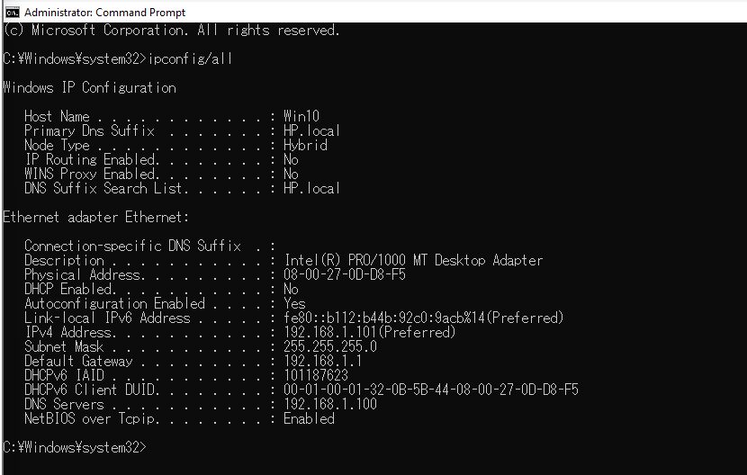
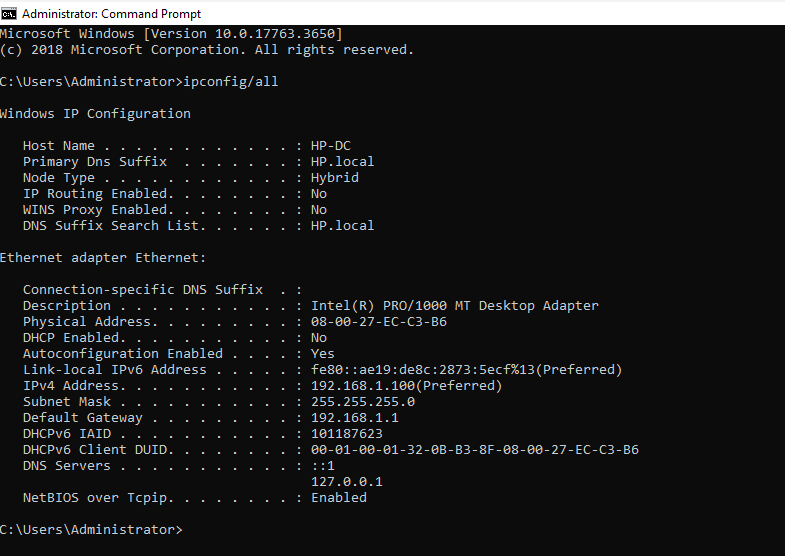

# Lab 1 – Virtual Network and Windows Server Environment

## Overview

This lab focused on building the virtual infrastructure that will be used throughout the ICT279 security administration labs.


## Implementation

### 1. Virtual Network Configuration

The virtual machines were connected to the same VirtualBox NAT Network so they could communicate with each other within the lab environment.

During the initial setup, the network adapters had to be configured correctly before communication between the virtual machines was possible.

### 2. Windows Server Configuration

The Windows Server was configured with a static IPv4 address:

- IP address: `192.168.1.100`
- Subnet mask: `255.255.255.0`
- Default gateway: `192.168.1.1`

A static IP address was used because the server needs a predictable network address for services such as DNS and Active Directory.

### 3. Windows 10 Client Configuration

The Windows 10 client was configured on the same subnet:

- IP address: `192.168.1.101`
- Subnet mask: `255.255.255.0`
- Default gateway: `192.168.1.1`
- Preferred DNS server: `192.168.1.100`

The Windows Server was used as the preferred DNS server in preparation for the Active Directory environment used in later labs.

The Windows 10 network configuration was verified using `ipconfig /all`.

The client was configured with the static IPv4 address `192.168.1.101/24`, using `192.168.1.1` as its default gateway and `192.168.1.100` as its DNS server.

The screenshot was captured after later domain configuration had been completed, which is why the system also shows the `HP.local` domain.



### 4. Ubuntu Client Configuration

The Ubuntu virtual machine was also connected to the same virtual network.

Its IPv4 address was configured as:

`192.168.1.104`

This placed the Ubuntu system on the same `192.168.1.0/24` network as the Windows Server and Windows 10 client.

#### Verification

The Windows Server network configuration was verified using `ipconfig /all`.

The output confirmed that the server was configured with the static IPv4 address `192.168.1.100/24` and the default gateway `192.168.1.1`.



## Connectivity Verification

Network communication between the Windows 10 client and Windows Server was tested using the `ping` command.

The server was first tested directly using its IPv4 address:

```powershell
ping 192.168.1.100
ping HP-DC

#### Verification

The Ubuntu network configuration was verified using:

```bash
ip addr
ip route


## Troubleshooting

### Destination Host Unreachable

During the initial network setup, communication between the virtual machines returned a `Destination Host Unreachable` message.

I checked the network configuration and found that the virtual machines needed to be connected to the same VirtualBox NAT Network.

After correcting the VirtualBox network configuration, I tested the connection again using `ping` and successfully established communication between the systems.

This helped me understand that correct IP addressing alone is not enough. The virtual network adapters must also be connected to the appropriate virtual network for the systems to communicate.


## Key Learning Outcomes

Through this lab I gained practical experience with:

- Creating a multi-machine virtual lab environment.
- Configuring VirtualBox networking.
- Assigning static IPv4 addresses.
- Understanding the `192.168.1.0/24` subnet.
- Configuring default gateways and DNS settings.
- Using `ipconfig`, `ip addr` and `ip route` to inspect network configuration.
- Using `ping` to verify communication between Windows and Linux systems.
- Troubleshooting virtual network connectivity problems.
- Understanding why servers require predictable network addresses.

This lab established the network infrastructure required for later work with Active Directory, authentication, access control and Group Policy.