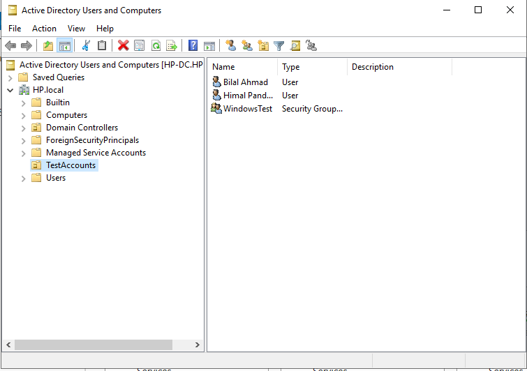
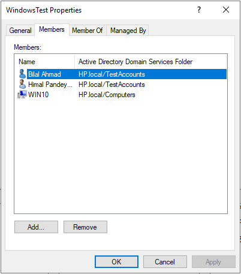
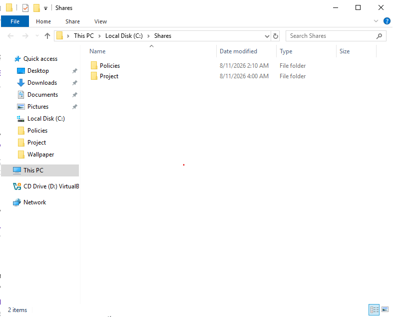
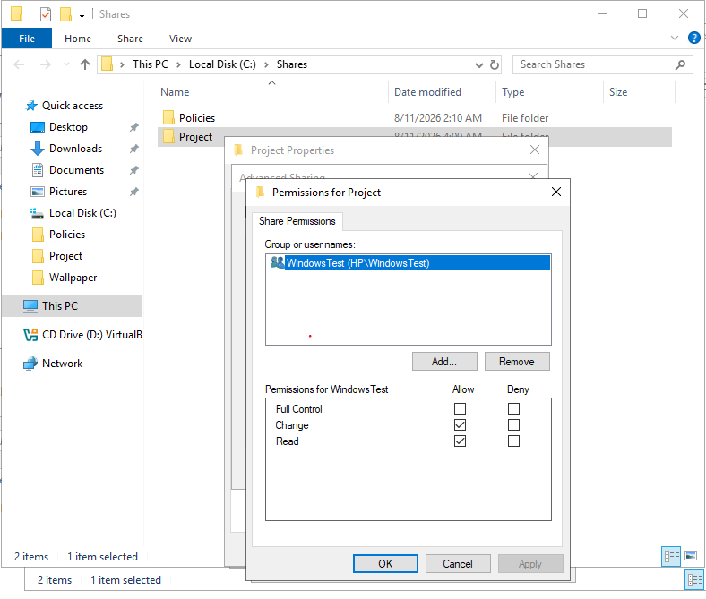
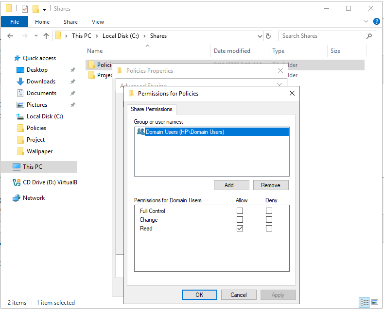
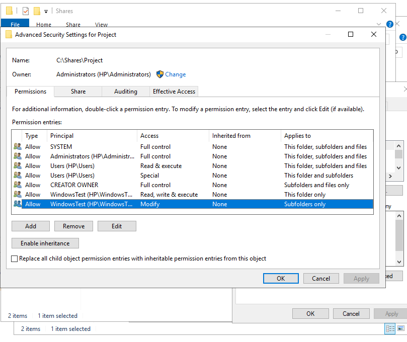
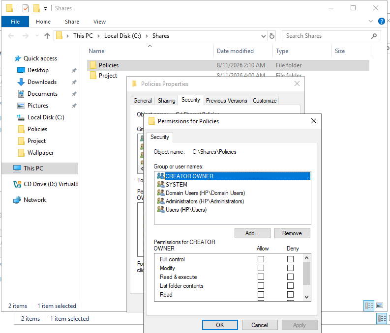
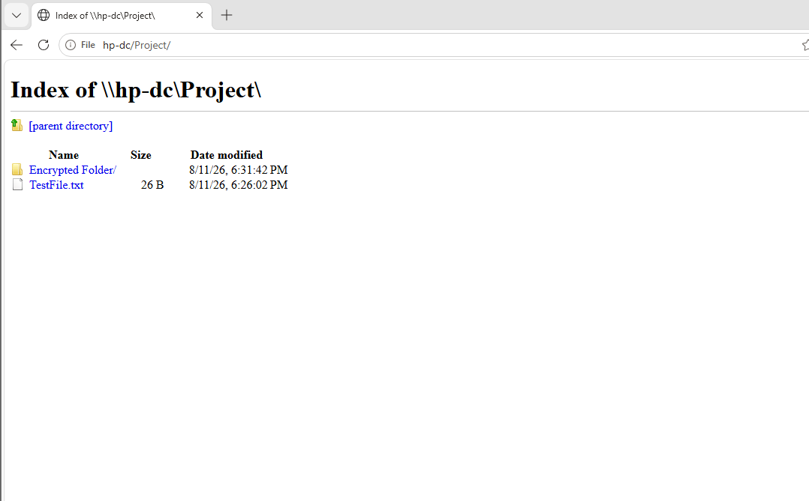
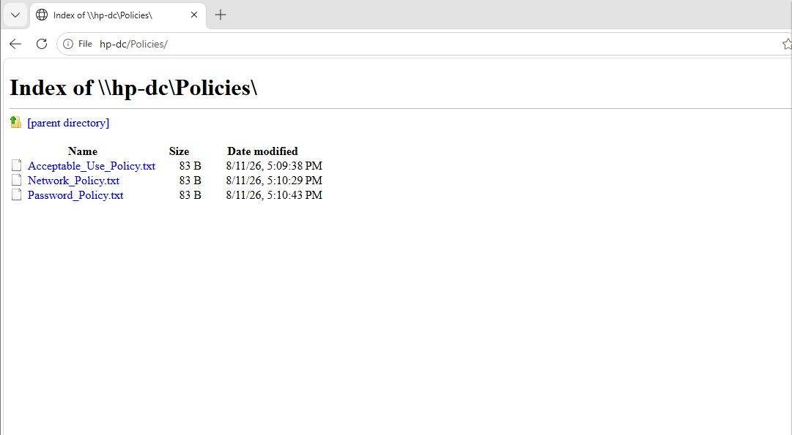

# Lab 2 – Windows AAA, Access Control and Encryption

## Overview

This lab focused on authentication, authorization and access control within a Windows domain environment.

The lab involved configuring and testing user accounts, groups, file shares, NTFS permissions and file encryption. Different user accounts were used to verify how Windows applies permissions and controls access to shared resources.

The exercises provided practical experience with managing access to resources in a Windows Server and Active Directory environment.

## Lab Environment

| System | Role |
|---|---|
| Windows Server | Active Directory, user/group and file resource administration |
| Windows 10 | Domain-joined client used for access testing |
| Active Directory | Centralised identity and access management |
| NTFS | File system permissions and access control |
| EFS | File encryption testing |

## Main Areas Covered

The lab included practical work involving:

- Active Directory users and groups.
- Authentication and authorization.
- Windows file sharing.
- Share permissions.
- NTFS permissions.
- User and group-based access control.
- Permission inheritance.
- Testing access using different domain accounts.
- Encrypting File System (EFS).
- Testing access to encrypted files.


## Implementation

### 1. Active Directory Users and Groups

Active Directory Users and Computers was used to manage identities within the `HP.local` domain.

A dedicated Organizational Unit (OU) named `TestAccounts` was used to organise accounts required for the lab exercises. The OU contained test user accounts and a security group that could be used when applying and testing access controls.

Using an OU provided a structured way to manage the accounts separately from the default Active Directory containers.



#### Security Group Configuration

A security group named `WindowsTest` was configured to group accounts that required access during the lab exercises.

The group contained domain user accounts as well as the Windows 10 computer account used in the lab environment.

Using a security group allows permissions to be assigned to the group rather than configuring access separately for every account. This makes access control easier to manage as users or computers can be added to or removed from the group when their access requirements change.



### 2. Windows File Shares

Two shared folders were configured on the Windows Server under `C:\Shares`:

- `Project`
- `Policies`

The shares were configured with different access requirements to demonstrate how Windows can control access to network resources using security groups and domain accounts.



#### Project Share

The `Project` share was configured for members of the `WindowsTest` security group.

At the share level, the group was granted:

- Read
- Change

Full Control was not granted.

This allowed members of the group to access and modify content while limiting administrative control over the share.



#### Policies Share

The `Policies` share was configured differently. `Domain Users` were granted Read access at the share level.

This allowed authenticated domain users to access policy documents while preventing them from modifying the contents through the share.



### 3. NTFS Permissions

NTFS permissions were also configured to provide more granular control over files and folders.

This demonstrated that share permissions and NTFS permissions are separate access-control mechanisms.

#### Project NTFS Permissions

The `Project` directory used multiple NTFS permission entries.

The `WindowsTest` security group was assigned permissions with different scopes, including permissions applying to the main folder and permissions applying to subfolders.

This allowed more precise control over what group members could do at different levels of the directory structure.



#### Policies NTFS Permissions

The `Policies` directory also used NTFS permissions to control access for domain users and administrative accounts.

The configuration included security principals such as:

- Domain Users
- Administrators
- SYSTEM
- Users
- CREATOR OWNER

These permissions work together with the share permissions when the directory is accessed across the network.



### 4. Client Access Verification

The configured shares were accessed from the domain-joined Windows 10 client to verify that the server resources were available over the network.

#### Project Share

The `Project` share was accessed using:

```text
\\HP-DC\Project
```

The client successfully accessed the share and could view the existing `TestFile.txt` file and the encrypted folder.



#### Policies Share

The `Policies` share was accessed using:

```text
\\HP-DC\Policies
```

The client successfully accessed the share and could view the policy documents stored on the server.



This verified that the domain client could access the shared resources hosted by the Windows Server.

### 5. Encrypting File System (EFS)

The lab also introduced the Windows Encrypting File System (EFS) as a method of protecting files stored on an NTFS volume.

An encrypted folder was created within the `Project` directory as part of the exercise. This demonstrated how Windows can apply file-level encryption in addition to the access controls provided by NTFS and share permissions.

The exercise helped distinguish between permission-based access control and encryption. Permissions determine whether an account is authorised to access a resource, while EFS provides file-level encryption for protected data.

The encrypted folder can be seen in the client-access evidence shown above.

## Troubleshooting

During the lab, access to shared resources depended on several layers of configuration, including domain membership, security group membership, share permissions and NTFS permissions.

Working through the exercises demonstrated that access problems should not be investigated by looking at only one permission setting. Both share-level and NTFS permissions need to be considered when troubleshooting access to network resources.

The lab also reinforced the importance of using security groups to manage access rather than assigning permissions individually to every user.

## Key Learning Outcomes

Through this lab I gained practical experience with:

- Managing users and security groups in Active Directory.
- Organising accounts using Organizational Units (OUs).
- Using security groups for group-based access control.
- Creating and managing Windows network shares.
- Configuring share permissions.
- Configuring NTFS permissions.
- Understanding permission scope and inheritance.
- Accessing server resources from a domain-joined Windows client.
- Understanding the relationship between authentication and authorization.
- Using EFS to provide file-level encryption.
- Troubleshooting access to shared resources.

This lab demonstrated how Active Directory identities, security groups, share permissions, NTFS permissions and encryption can work together to control and protect access to organisational resources.