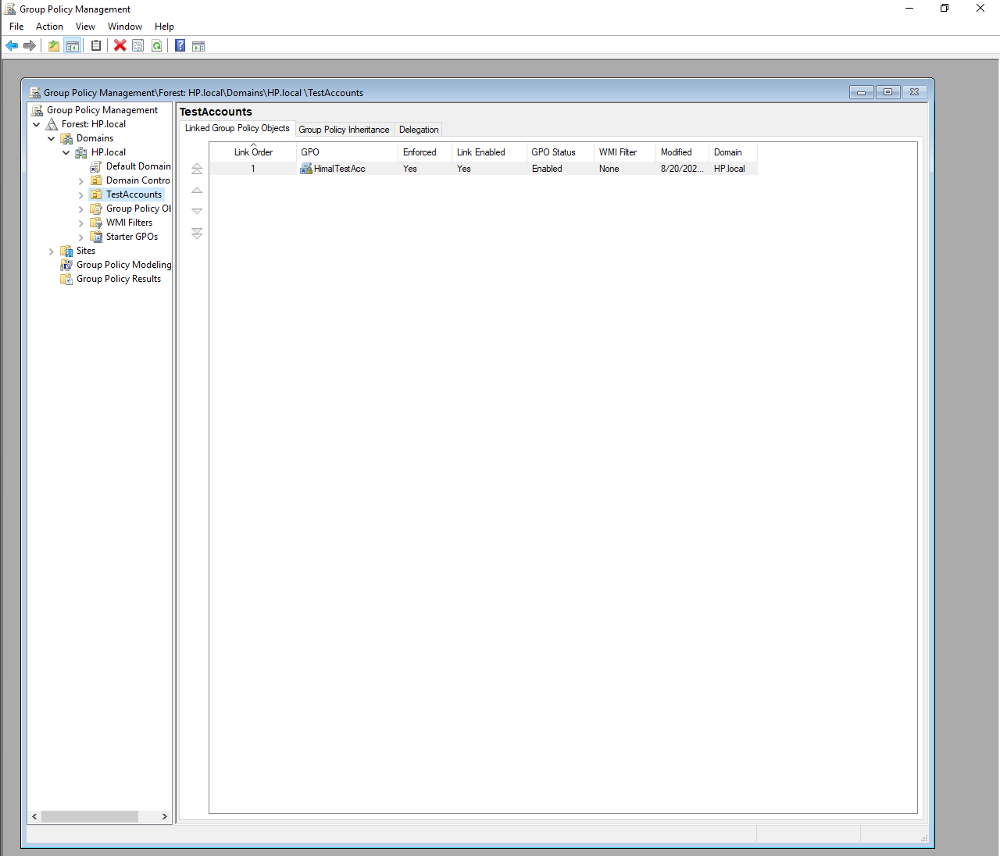
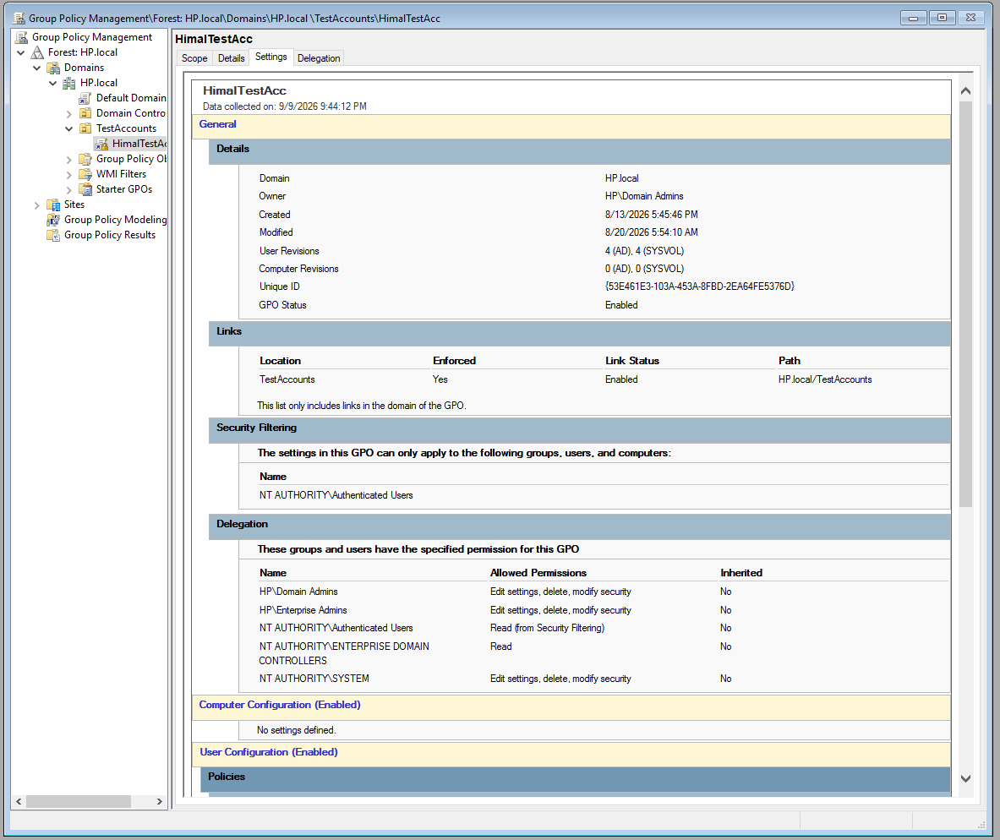
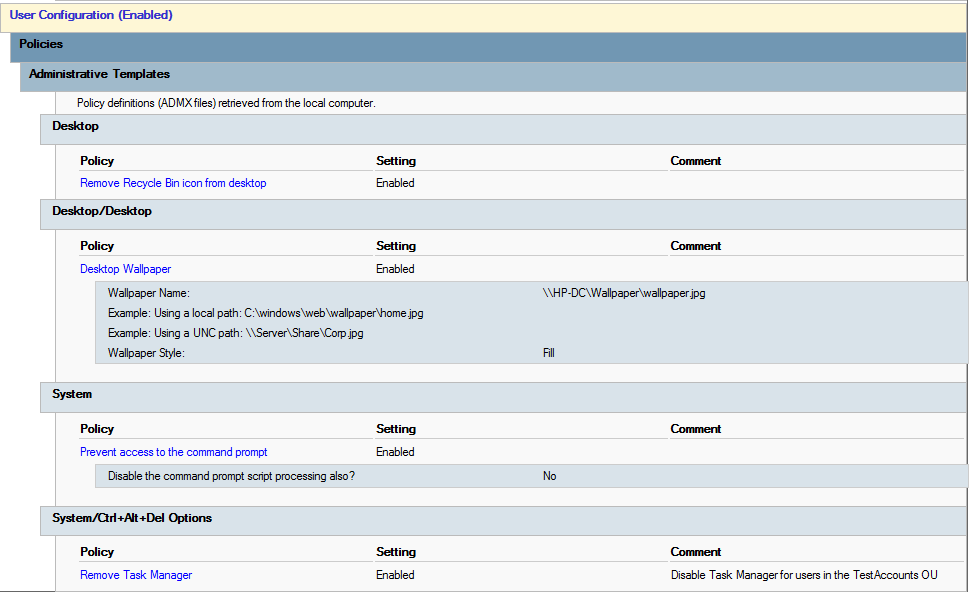
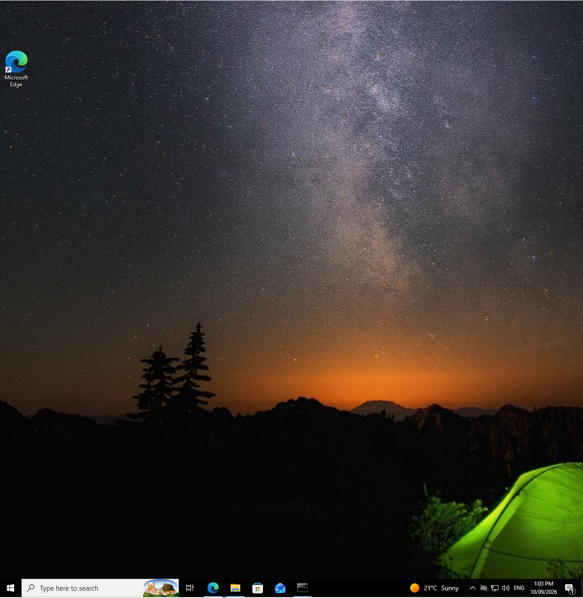

# Lab 3 – Windows Group Policy Administration

## Overview

This lab focused on using Group Policy within an Active Directory domain to centrally configure and restrict settings for domain users.

Group Policy Objects (GPOs) were created and applied to accounts within the `TestAccounts` Organizational Unit (OU). The exercises demonstrated how administrators can centrally enforce desktop settings and user restrictions rather than configuring each computer or account individually.

## Lab Environment

| Component | Role |
|---|---|
| Windows Server | Domain Controller and Group Policy administration |
| Active Directory | User and OU management |
| Group Policy Management | Creation and management of GPOs |
| Windows 10 | Domain-joined client used for policy testing |
| TestAccounts OU | Target OU for the configured policies |

## Main Areas Covered

The lab included practical work involving:

- Creating and managing Group Policy Objects.
- Linking policies to an Active Directory OU.
- Applying user configuration policies.
- Configuring a centrally managed desktop wallpaper.
- Sharing the wallpaper resource so domain clients could access it.
- Preventing users from changing the configured wallpaper.
- Removing access to Recycle Bin functionality.
- Applying updated policies to the Windows 10 client.
- Verifying that Group Policy settings were successfully enforced.

## Implementation

### 1. Group Policy Object and OU Linking

A Group Policy Object named `HimalTestAcc` was configured within the `HP.local` Active Directory domain.

The GPO was linked to the `TestAccounts` Organizational Unit (OU), allowing the configured policies to target the test accounts contained within that OU rather than applying the settings across the entire domain.

Group Policy Management confirmed that the GPO link was enabled and the policy itself was enabled.

#### GPO Configuration

The `HimalTestAcc` GPO was configured primarily with user-based policy settings.

The Group Policy settings report confirmed that:

- The GPO was enabled.
- It was linked to the `TestAccounts` OU.
- The link was enforced.
- Security filtering included authenticated users.
- No computer-specific settings were configured.
- The configured restrictions were applied through User Configuration.

### 2. User Policy Configuration

The `HimalTestAcc` GPO contained several user-based administrative policies designed to demonstrate centralised configuration and restriction of domain user accounts.

The configured policies included:

- Removing the Recycle Bin icon from the desktop.
- Enforcing a centrally managed desktop wallpaper.
- Preventing access to Command Prompt.
- Removing access to Task Manager.

These settings were configured under User Configuration and applied to users within the `TestAccounts` OU.

#### Desktop Wallpaper

The Desktop Wallpaper policy was enabled and configured to retrieve the wallpaper from the network path:

`\\HP-DC\Wallpaper\wallpaper.jpg`

The wallpaper style was configured as `Fill`.

Hosting the wallpaper on a shared server location allowed the domain client to retrieve the same centrally managed resource when the policy was applied.

#### User Restrictions

Additional administrative restrictions were enabled through the same GPO.

The Recycle Bin icon was removed from the user's desktop, while access to Command Prompt and Task Manager was restricted.

These exercises demonstrated how Group Policy can centrally control the user environment without manually configuring each client computer.

### 3. Client-Side Policy Verification

The configured Group Policy was verified on the domain-joined Windows 10 client using an account targeted through the `TestAccounts` OU.

After the policy was applied, the centrally configured wallpaper was displayed on the Windows 10 desktop.

The Recycle Bin icon was also removed from the desktop, demonstrating that the user restriction configured in the GPO had been successfully applied.

The client-side result demonstrated how settings configured centrally on the Windows Server could be enforced on domain users through Active Directory and Group Policy.