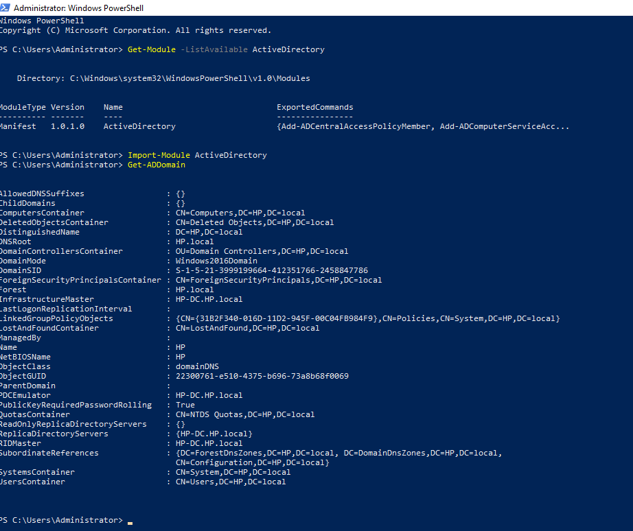
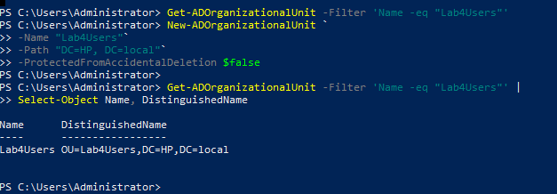
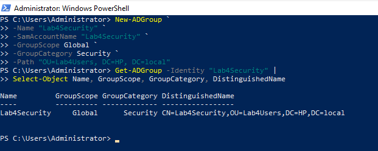
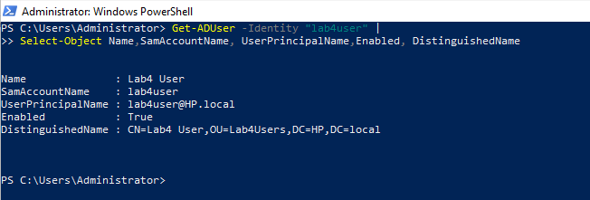
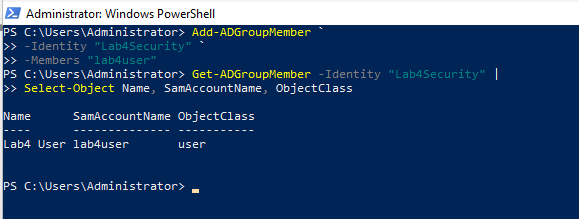
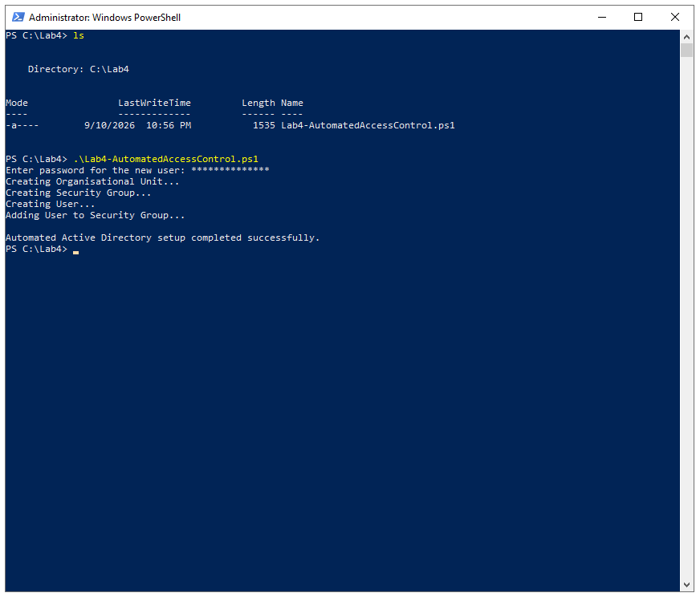
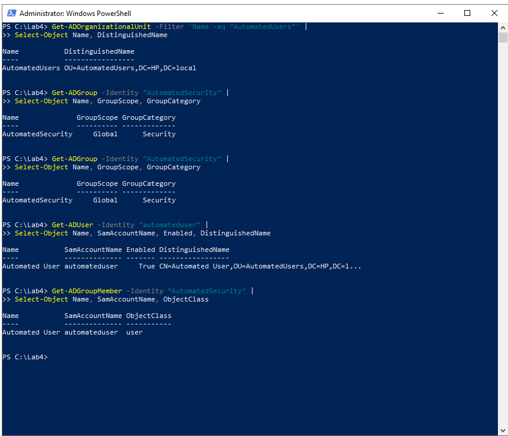
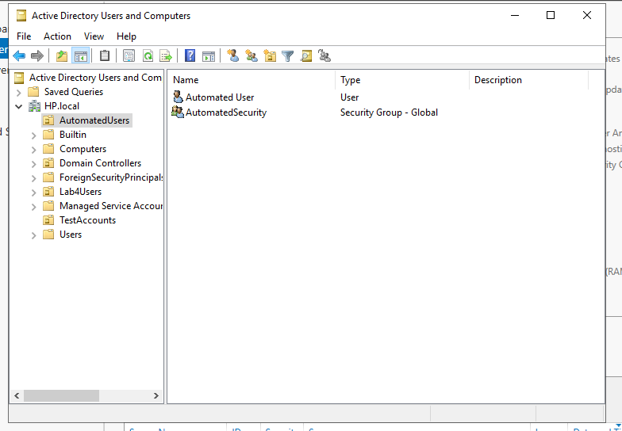

# Lab 04 – Automated Access Control

## Overview

This lab focused on automating Active Directory administration using PowerShell. In the earlier Active Directory lab, users, groups and organisational units were created manually. In this lab, I used the Active Directory PowerShell module to automate these administrative tasks.

The process was first tested using individual PowerShell commands. These commands were then combined into a PowerShell script that automatically creates an organisational unit, security group and user account, and adds the user to the security group.

## Lab Environment

- Windows Server 2019 Domain Controller
- Active Directory Domain Services (AD DS)
- Domain: `HP.local`
- Windows PowerShell
- ActiveDirectory PowerShell module

## Main Areas Covered

- Using the Active Directory PowerShell module
- Creating an Organisational Unit (OU) with PowerShell
- Creating an Active Directory security group
- Creating and enabling an Active Directory user
- Adding a user to a security group
- Automating multiple Active Directory tasks with a PowerShell script
- Basic PowerShell error handling
- Verifying automated changes through PowerShell and Active Directory Users and Computers

---

## 1. Verifying Active Directory PowerShell Access

Before automating Active Directory tasks, I checked that the Active Directory PowerShell module was available on the Domain Controller.

```powershell
Get-Module -ListAvailable ActiveDirectory
```

The module was then imported:

```powershell
Import-Module ActiveDirectory
```

Finally, I used `Get-ADDomain` to confirm that PowerShell could communicate with the Active Directory domain.

```powershell
Get-ADDomain
```

The command successfully returned information about the `HP.local` domain.



---

## 2. Creating an Organisational Unit

Before building the complete automation script, I tested each Active Directory operation individually.

An OU named `Lab4Users` was created in the `HP.local` domain using:

```powershell
New-ADOrganizationalUnit `
    -Name "Lab4Users" `
    -Path "DC=HP,DC=local" `
    -ProtectedFromAccidentalDeletion $false
```

I then verified that the OU existed:

```powershell
Get-ADOrganizationalUnit -Filter 'Name -eq "Lab4Users"' |
Select-Object Name, DistinguishedName
```

The result confirmed the distinguished name:

```text
OU=Lab4Users,DC=HP,DC=local
```



---

## 3. Creating a Security Group

Next, I created a Global Security group named `Lab4Security` inside the new OU.

```powershell
New-ADGroup `
    -Name "Lab4Security" `
    -SamAccountName "Lab4Security" `
    -GroupScope Global `
    -GroupCategory Security `
    -Path "OU=Lab4Users,DC=HP,DC=local"
```

The group was verified using:

```powershell
Get-ADGroup -Identity "Lab4Security" |
Select-Object Name, GroupScope, GroupCategory, DistinguishedName
```

The output confirmed that `Lab4Security` was created as a Global Security group inside the `Lab4Users` OU.



---

## 4. Creating an Active Directory User

A user account named `Lab4 User` with the username `lab4user` was created inside the `Lab4Users` OU.

Instead of storing the user's password as plain text, the password was entered securely at runtime:

```powershell
$Password = Read-Host "Enter password for Lab4 User" -AsSecureString
```

The account was then created using `New-ADUser`:

```powershell
New-ADUser `
    -Name "Lab4 User" `
    -GivenName "Lab4" `
    -Surname "User" `
    -SamAccountName "lab4user" `
    -UserPrincipalName "lab4user@HP.local" `
    -Path "OU=Lab4Users,DC=HP,DC=local" `
    -AccountPassword $Password `
    -Enabled $true
```

The account was verified with `Get-ADUser`, confirming that the user existed and was enabled.



---

## 5. Adding the User to the Security Group

The new user was then added to `Lab4Security`:

```powershell
Add-ADGroupMember `
    -Identity "Lab4Security" `
    -Members "lab4user"
```

Group membership was verified using:

```powershell
Get-ADGroupMember -Identity "Lab4Security" |
Select-Object Name, SamAccountName, ObjectClass
```

The output showed `Lab4 User` as a member of the group.



---

## 6. Automating the Process with PowerShell

After testing each operation individually, I combined the commands into a single PowerShell script.

For the automated test, the script created:

- OU: `AutomatedUsers`
- Security Group: `AutomatedSecurity`
- User: `Automated User`
- Username: `automateduser`

The script used variables so that the Active Directory object information could be managed from one section.

```powershell
Import-Module ActiveDirectory

$ErrorActionPreference = "Stop"

# Variables
$OUName = "AutomatedUsers"
$GroupName = "AutomatedSecurity"
$UserName = "automateduser"
$UserFullName = "Automated User"
$DomainDN = "DC=HP,DC=local"

try {

    # Request password securely
    $Password = Read-Host "Enter password for the new user" -AsSecureString

    # Create OU
    Write-Host "Creating Organisational Unit..."
    New-ADOrganizationalUnit `
        -Name $OUName `
        -Path $DomainDN `
        -ProtectedFromAccidentalDeletion $false

    # Create Security Group
    Write-Host "Creating Security Group..."
    New-ADGroup `
        -Name $GroupName `
        -SamAccountName $GroupName `
        -GroupScope Global `
        -GroupCategory Security `
        -Path "OU=$OUName,$DomainDN"

    # Create User
    Write-Host "Creating User..."
    New-ADUser `
        -Name $UserFullName `
        -GivenName "Automated" `
        -Surname "User" `
        -SamAccountName $UserName `
        -UserPrincipalName "$UserName@HP.local" `
        -Path "OU=$OUName,$DomainDN" `
        -AccountPassword $Password `
        -Enabled $true

    # Add User to Security Group
    Write-Host "Adding User to Security Group..."
    Add-ADGroupMember `
        -Identity $GroupName `
        -Members $UserName

    Write-Host ""
    Write-Host "Automated Active Directory setup completed successfully."

}
catch {

    Write-Host ""
    Write-Host "Automation failed: $($_.Exception.Message)"
}
```

The script successfully completed all four operations.



### Error Handling

During testing, an unsuccessful first attempt left some Active Directory objects already created. When the script was executed again, PowerShell reported that the OU, group and account already existed.

To make the automation handle failures more clearly, I used:

```powershell
$ErrorActionPreference = "Stop"
```

together with a `try/catch` block. This prevents the script from continuing through subsequent operations after an error and avoids incorrectly displaying a successful completion message.

---

## 7. Verifying the Automated Configuration

After the script completed, I verified the automatically generated Active Directory objects using PowerShell.

### OU Verification

```powershell
Get-ADOrganizationalUnit -Filter 'Name -eq "AutomatedUsers"' |
Select-Object Name, DistinguishedName
```

### Group Verification

```powershell
Get-ADGroup -Identity "AutomatedSecurity" |
Select-Object Name, GroupScope, GroupCategory
```

### User Verification

```powershell
Get-ADUser -Identity "automateduser" |
Select-Object Name, SamAccountName, Enabled, DistinguishedName
```

### Group Membership Verification

```powershell
Get-ADGroupMember -Identity "AutomatedSecurity" |
Select-Object Name, SamAccountName, ObjectClass
```

The results confirmed that the OU, security group and enabled user account had been created and that the user was a member of the security group.



---

## 8. Verifying the Objects in Active Directory

As a final check, I opened Active Directory Users and Computers and inspected the `AutomatedUsers` OU.

The automatically created objects were visible inside the OU:

- `Automated User`
- `AutomatedSecurity`

This confirmed through the graphical management interface that the PowerShell automation had successfully modified Active Directory.



---

## Outcome

The lab demonstrated how Active Directory administration can be automated using PowerShell instead of repeatedly creating objects through the graphical interface.

I successfully automated the creation of an organisational unit, Global Security group and enabled user account, as well as automatically assigning the user to the security group. The resulting Active Directory objects were verified through both PowerShell and Active Directory Users and Computers.

The lab also demonstrated the importance of secure password handling, verification and basic error handling when developing administrative automation scripts.