# Lab 05 – Linux Authentication and Access Control

## Overview

This lab focused on authentication and access control in Linux and integrating an Ubuntu workstation with the existing Windows Active Directory environment.

The lab began with local Linux user and group management, including shared file permissions between multiple users. I then configured Pluggable Authentication Modules (PAM) to restrict SSH access for a selected user without disabling their local account.

Finally, the Ubuntu machine was joined to the `HP.local` Active Directory domain using Kerberos, realmd and SSSD. A domain user was authenticated on Ubuntu and Kerberos was then used to access and mount a Windows SMB share without providing separate SMB credentials.

## Lab Environment

- Ubuntu 20.04 LTS
- Windows Server 2019 Domain Controller
- Domain: `HP.local`
- Kerberos Realm: `HP.LOCAL`
- Domain Controller: `HP-DC.HP.local`
- Domain Controller IP: `192.168.1.100`
- Ubuntu Hostname: `ubuntu-20`
- Ubuntu IP: `192.168.1.104`
- Active Directory Domain Services
- SSSD
- Kerberos
- PAM
- OpenSSH
- Samba / SMB / CIFS

## Main Areas Covered

- Linux local user and group management
- Linux file ownership and permissions
- Shared group-based file access
- SSH authentication
- PAM authentication controls
- Restricting selected users from SSH
- Active Directory domain integration
- Kerberos authentication
- SSSD identity and authentication services
- Active Directory users on Linux
- SMB access using Kerberos
- Mounting Windows shares using CIFS


---

# Task 1 – Basic Local User and Group Creation

## 1. Creating a Local Linux User

I first created a new local user named `david` using the `adduser` command.

```bash
sudo adduser david
```

The command created the user account, a primary group for the user, and the home directory `/home/david`.

I verified that the account had been added to the local user database:

```bash
getent passwd david
```

I also confirmed that an entry existed in `/etc/shadow` without displaying the stored password hash:

```bash
sudo grep '^david:' /etc/shadow | cut -d: -f1
```

Finally, I checked David's user ID and initial group membership:

```bash
id david
```

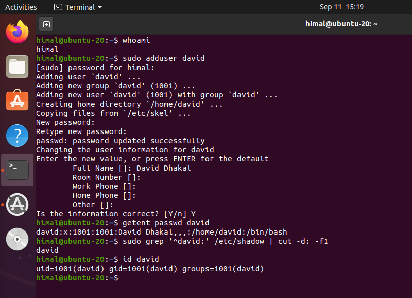

---

## 2. Creating a Shared Project Group

A shared group was created so that multiple users could be given access to the same project files.

The group was named `projetx`.

```bash
sudo addgroup projetx
```

David was then added to the group:

```bash
sudo adduser david projetx
```

After starting a login session as David, I used `id` to confirm that the account belonged to both its primary group and the new project group.

```bash
su - david
id
```

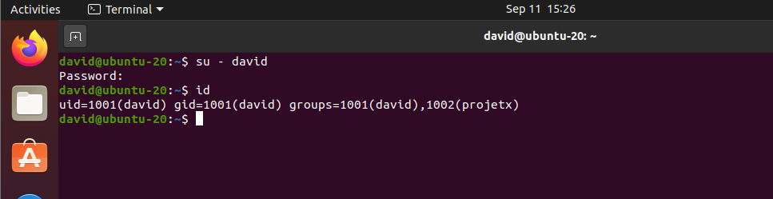

> Note: The group was created as `projetx` in the lab environment and this name is used consistently throughout the remaining configuration.

---

## 3. Adding a Second User to the Group

A second local user named `ananda` was created to test shared group access.

```bash
sudo adduser ananda
```

The account was then added to the same project group:

```bash
sudo adduser ananda projetx
```

The group membership was verified using:

```bash
getent group projetx
```

The result showed both users as members:

```text
projetx:x:1002:david,ananda
```

I also checked Ananda's identity and supplementary groups:

```bash
id ananda
```

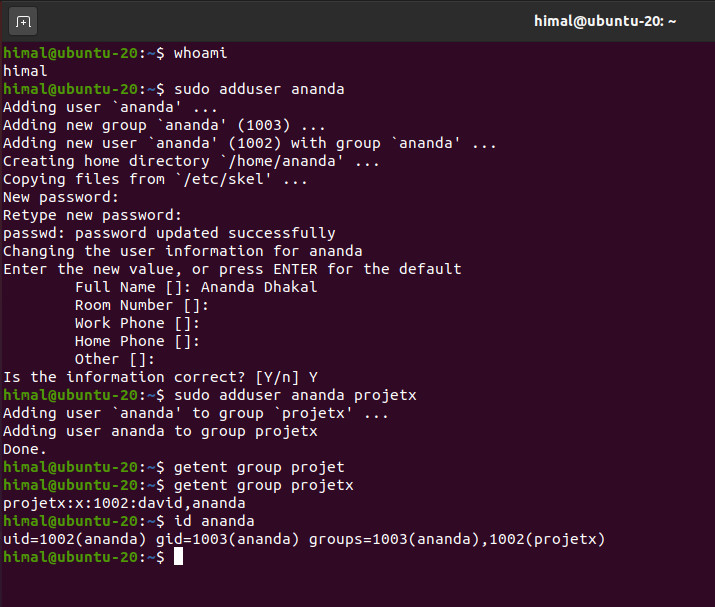

---

## 4. Configuring Shared File Permissions

A file was created by David and configured so that:

- the owner could read and write;
- members of `projetx` could read and write;
- other users could only read the file.

The required permission mode was:

```text
rw-rw-r--
```

which corresponds to numeric mode `664`.

The group ownership and permissions were configured using:

```bash
chgrp projetx projectx.txt
chmod 664 projectx.txt
```

The result was verified with:

```bash
ls -l projectx.txt
```

The file was owned by `david`, assigned to the `projetx` group and configured with `rw-rw-r--` permissions.

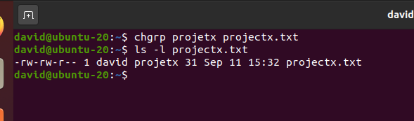

---

## 5. Testing Shared Group Access

To properly test shared access, I created a project directory under `/srv` and assigned it to the `projetx` group:

```bash
sudo mkdir /srv/projetx
sudo chown root:projetx /srv/projetx
sudo chmod 2775 /srv/projetx
```

The `2` in `2775` enables the setgid bit on the directory. This causes files created inside the directory to inherit the `projetx` group.

David created a project file:

```bash
echo "ProjectX file created by David" > /srv/projetx/projectx.txt
chmod 664 /srv/projetx/projectx.txt
```

I then logged in as Ananda and confirmed the account belonged to `projetx`:

```bash
su - ananda
id
```

Ananda successfully appended data to the file created by David:

```bash
echo "Ananda successfully modified the shared file" >> /srv/projetx/projectx.txt
```

The contents were then checked:

```bash
cat /srv/projetx/projectx.txt
```

The result contained data written by both users:

```text
ProjectX file created by David
Ananda successfully modified the shared file
```

This demonstrated that the group read/write permissions were functioning correctly.

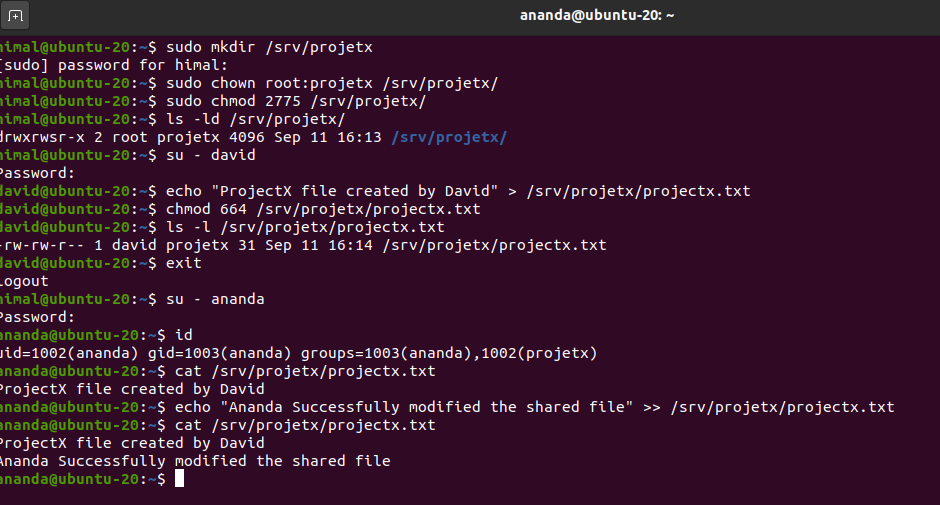

## Task 1 Outcome

Task 1 demonstrated the relationship between Linux users, groups, file ownership and permission bits. Two separate user accounts were given membership of a common group, allowing them to collaborate on a file while users outside the group retained read-only access.


---

# Task 2 – Customising Authentication with PAM

## 6. Installing and Verifying the SSH Server

The OpenSSH server was installed so that remote authentication could be tested.

```bash
sudo apt-get update
sudo apt-get install openssh-server
```

I checked the SSH service using:

```bash
sudo systemctl status ssh
```

The service reported:

```text
Active: active (running)
```

The Ubuntu workstation's current IP address was also checked:

```bash
hostname -I
ip addr
```

The Ubuntu VM was using `192.168.1.104` and SSH was listening on port 22.

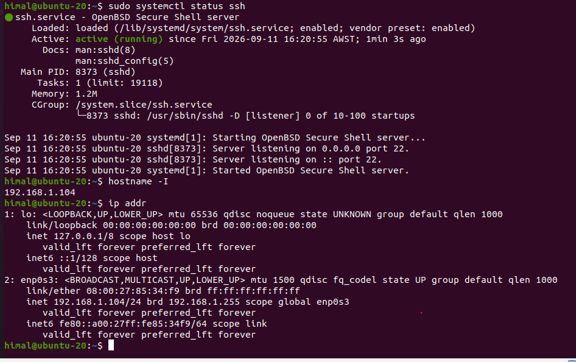

---

## 7. Testing SSH Before Applying PAM Restrictions

Before changing the PAM configuration, I tested remote authentication from the Windows workstation.

Connectivity to Ubuntu was first confirmed:

```powershell
ping 192.168.1.104
```

I then connected as David:

```powershell
ssh david@192.168.1.104
```

After authentication, `whoami` confirmed that the remote session was running as `david`.

The same test was performed with Ananda:

```powershell
ssh ananda@192.168.1.104
```

Both users were able to authenticate successfully before the PAM restriction was introduced.

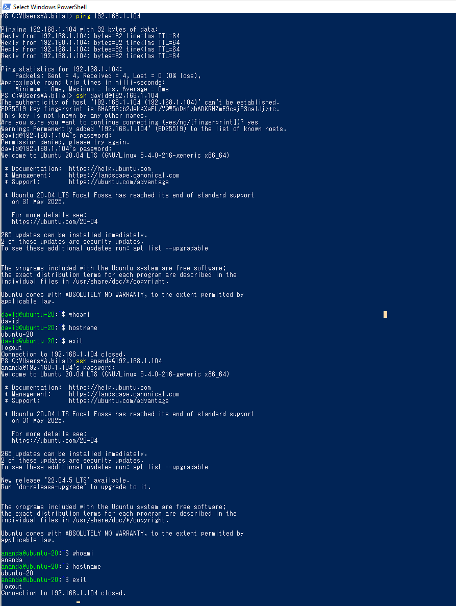

---

## 8. Restricting SSH Access with PAM

The SSH PAM configuration was backed up before making changes:

```bash
sudo cp /etc/pam.d/sshd /etc/pam.d/sshd.backup
```

I then added the following rule to `/etc/pam.d/sshd`:

```text
auth required pam_listfile.so onerr=succeed item=user sense=deny file=/etc/ssh/deniedusers
```

A denied-user list was created containing:

```text
ananda
```

The file permissions were restricted to root:

```bash
sudo chmod 600 /etc/ssh/deniedusers
```

The PAM rule and denied-user file were then verified.

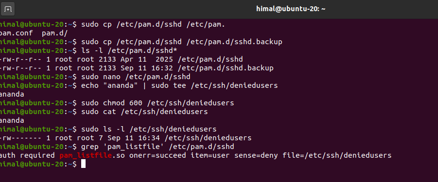

---

## 9. Testing the PAM Restriction

After applying the PAM rule, I repeated the SSH tests from Windows.

Ananda was denied remote access even when attempting to authenticate with the account password:

```powershell
ssh ananda@192.168.1.104
```

The connection returned:

```text
Permission denied, please try again.
```

David was then tested:

```powershell
ssh david@192.168.1.104
```

David continued to authenticate successfully.

Ananda was also tested locally on Ubuntu using:

```bash
su - ananda
whoami
```

The local authentication succeeded. This confirmed that the account itself had not been disabled; the restriction applied specifically to SSH through the PAM configuration.

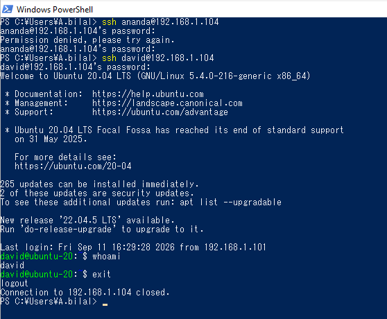

## Task 2 Outcome

PAM was used to change authentication behaviour for the SSH service. Before the configuration change, both local users could authenticate remotely. After adding `ananda` to the PAM deny list, Ananda was prevented from using SSH while David remained unaffected and Ananda could still authenticate locally.

---

# Task 3 – Connecting Linux to the Windows Domain

## 10. Verifying DNS and Domain Connectivity

Before joining Ubuntu to Active Directory, I verified that the Ubuntu workstation could communicate with the Domain Controller and resolve the domain through DNS.

The environment used:

```text
Domain:            HP.local
Kerberos Realm:    HP.LOCAL
Domain Controller: HP-DC.HP.local
DC IP Address:     192.168.1.100
Ubuntu IP Address: 192.168.1.104
```

The network configuration was checked using:

```bash
ip route
resolvectl status
```

Ubuntu was configured to use `192.168.1.100`, the Windows Domain Controller, as its DNS server.

Connectivity and name resolution were then tested:

```bash
ping -c 4 192.168.1.100
nslookup HP.local
nslookup HP-DC.HP.local
```

The Domain Controller responded successfully and both the domain and server hostname resolved to `192.168.1.100`.

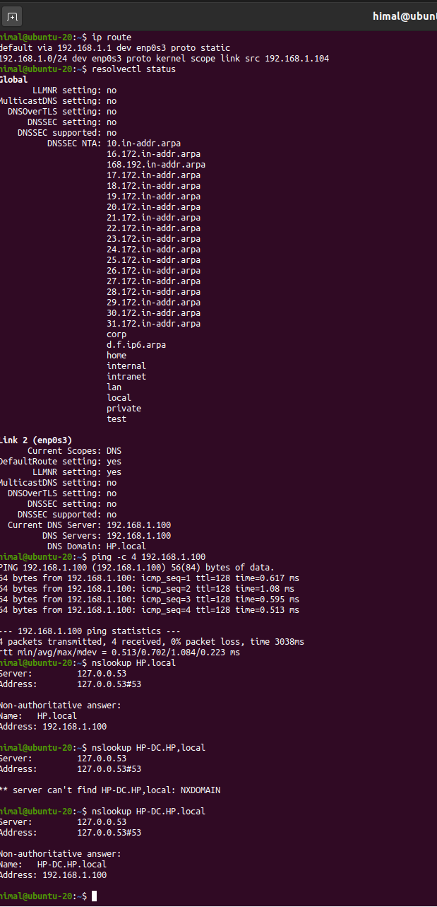

---

## 11. Installing Active Directory Integration Packages

The required packages for Kerberos and Active Directory integration were installed:

```bash
sudo su
apt-get install realmd sssd samba-common samba-common-bin samba-libs sssd-tools krb5-user adcli packagekit -y
```

During the Kerberos configuration, the default Kerberos realm was configured as:

```text
HP.LOCAL
```

Before joining the machine to the domain, I used `realmd` to discover the realm:

```bash
realm discover HP.local
```

The result identified:

```text
realm-name: HP.LOCAL
domain-name: hp.local
configured: no
server-software: active-directory
client-software: sssd
```

This confirmed that Ubuntu could discover the Active Directory environment but had not yet joined it.

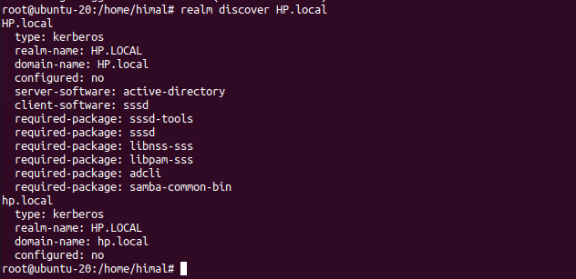

---

## 12. Joining Ubuntu to Active Directory

Ubuntu was joined to the Active Directory domain using the Domain Administrator account:

```bash
realm -v join -U Administrator HP.LOCAL
```

After the join completed, I checked the configuration:

```bash
realm list
```

The output now reported:

```text
configured: kerberos-member
```

It also identified Active Directory as the server software and SSSD as the client software.

This confirmed that the Ubuntu workstation had successfully become a member of the `HP.local` domain.

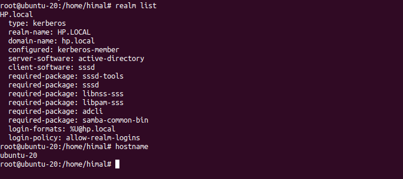

---

## 13. Configuring SSSD and Domain User Home Directories

The PAM configuration was updated using:

```bash
pam-auth-update
```

The following option was enabled:

```text
Create home directory on login
```

This allows a home directory to be created automatically when an Active Directory user logs into the Linux machine for the first time.

SSSD was then restarted:

```bash
systemctl restart sssd
```

Its status was checked using:

```bash
systemctl status sssd
```

The service reported:

```text
Active: active (running)
```

I also verified that the PAM home-directory module was configured:

```bash
grep pam_mkhomedir /etc/pam.d/common-session
```

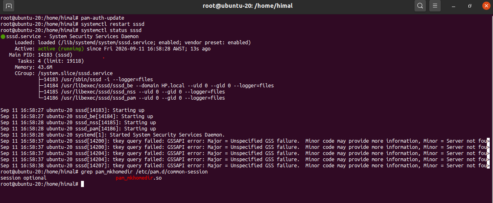

---

## 14. Verifying the Ubuntu Computer in Active Directory

After the successful realm join, I opened Active Directory Users and Computers on the Windows Server.

A new computer object named:

```text
UBUNTU-20
```

was visible under the `Computers` container in the `HP.local` domain.

This provided Windows-side confirmation that the Linux workstation had successfully joined Active Directory.

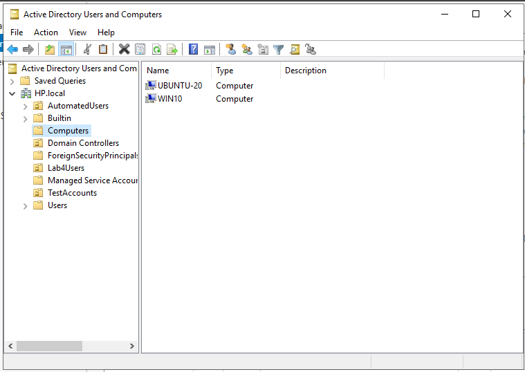

---

## 15. Authenticating an Active Directory User on Ubuntu

I tested Active Directory identity resolution from Ubuntu using the domain account:

```text
P.himal@HP.local
```

SSSD successfully resolved the account using:

```bash
id 'P.himal@hp.local'
```

I also queried the account through the system identity database:

```bash
getent passwd 'P.himal@hp.local'
```

The domain user was then used for an authentication test:

```bash
su - 'P.himal@hp.local'
```

After successful authentication, I checked:

```bash
whoami
pwd
id
```

The login succeeded and PAM automatically created the user's home directory:

```text
/home/p.himal@HP.local
```

The `id` output also showed Active Directory group memberships, demonstrating that SSSD was providing both domain identity and group information to Ubuntu.

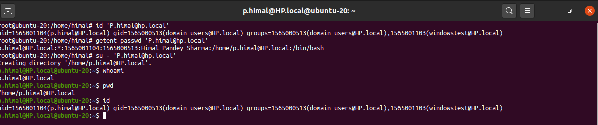

---

## 16. Obtaining Kerberos Tickets for Windows File Sharing

The next stage was to access Windows SMB resources using Kerberos authentication.

The required tools were installed:

```bash
sudo apt install cifs-utils keyutils smbclient -y
```

As the domain user, a Kerberos Ticket Granting Ticket was obtained:

```bash
kinit 'P.himal@HP.LOCAL'
```

The ticket cache was inspected with:

```bash
klist
```

I then queried the SMB shares on the Domain Controller using Kerberos:

```bash
smbclient -L //HP-DC.HP.local -k
```

The command returned the available Windows shares, including:

```text
Policies
Project
Wallpaper
```

Running `klist` again showed an additional CIFS service ticket:

```text
cifs/HP-DC.HP.local@HP.LOCAL
```

This demonstrated that Kerberos was being used to obtain a service-specific ticket for SMB access.

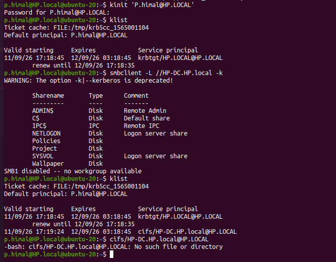

---

## 17. Accessing the Windows Policies Share

I then connected directly to the `Policies` share:

```bash
smbclient //HP-DC.HP.local/Policies -k
```

Kerberos authentication allowed access without entering separate SMB credentials.

At the SMB prompt, I listed the files:

```text
smb: \> ls
```

The Windows share contained files including:

```text
Acceptable_Use_Policy.txt
Network_Policy.txt
Password_Policy.txt
```

The `pwd` command confirmed that the remote working directory was the `Policies` share on `HP-DC.HP.local`.

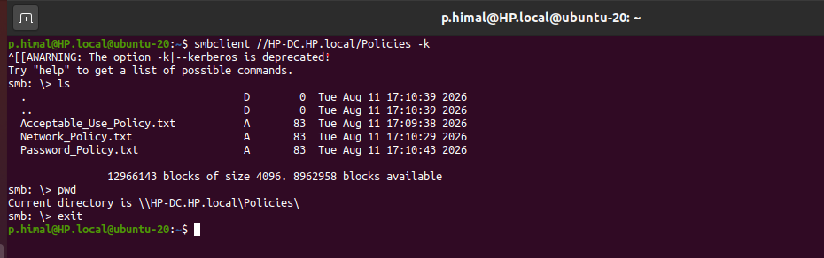

---

## 18. Mounting the Windows Share with CIFS and Kerberos

The final step was to mount the Windows `Policies` share so that it could be accessed as part of the Linux filesystem.

A mount point was created inside the domain user's home directory:

```bash
mkdir ~/policies
```

The domain user initially did not have permission to use `sudo`. A sudoers configuration was therefore created using:

```bash
sudo visudo -f /etc/sudoers.d/domain_admins
```

The domain account was granted sudo access:

```text
p.himal@HP.local ALL=(ALL) ALL
```

The sudoers configuration was validated using:

```bash
sudo visudo -c
```

After confirming that the configuration parsed successfully, the domain account was able to execute privileged commands.

The Windows share was then mounted using CIFS with Kerberos authentication:

```bash
sudo mount -t cifs \
-o user=$USER,cruid=$(id -u),gid=$(id -g),uid=$(id -u),sec=krb5 \
//HP-DC.HP.local/Policies \
"$HOME/policies"
```

The mount was verified with:

```bash
mount | grep Policies
```

The files were then accessible directly through the Linux filesystem:

```bash
ls -l "$HOME/policies"
```

I also successfully read a file from the Windows share through the mounted directory.

```bash
cat "$HOME/policies/Acceptable_Use_Policy.txt"
```

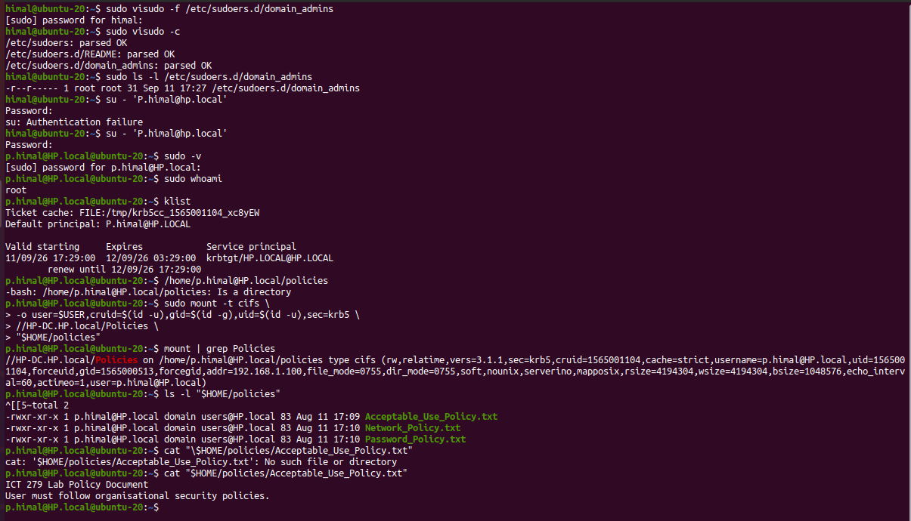

After testing, the share was unmounted:

```bash
sudo umount "$HOME/policies"
```

Running the following command returned no mounted `Policies` share:

```bash
mount | grep Policies
```

---

## Task 3 Outcome

Ubuntu was successfully integrated into the existing Windows Active Directory environment using realmd, Kerberos and SSSD.

The Linux workstation was able to resolve Active Directory identities, authenticate a domain user, obtain domain group information and automatically create a Linux home directory for the user.

Kerberos was also successfully used for Windows file sharing. The domain user obtained a CIFS service ticket, accessed the `Policies` share through `smbclient`, and mounted the same share into the Linux filesystem using CIFS with Kerberos authentication.

---

# Lab Outcome

This lab demonstrated how authentication and access control can operate across both Linux and Windows environments.

Local Linux users and groups were first used to implement shared file access through Unix ownership and permission controls. PAM was then used to customise SSH authentication so that remote access could be denied to a selected user without disabling local authentication.

Finally, Ubuntu was joined to the `HP.local` Active Directory domain. SSSD provided Active Directory identity and group information to Linux, while Kerberos provided authentication for both domain login and Windows SMB services.

The completed environment demonstrated centralised authentication between Windows and Linux as well as Kerberos-based access to Windows file shares from an Active Directory-integrated Ubuntu workstation.