# Lab 06 – Certificates and EFS Recovery

## Overview

This lab focused on Public Key Infrastructure (PKI), certificate deployment and recovery of data protected using the Windows Encrypting File System (EFS).

I first installed and configured Active Directory Certificate Services (AD CS) on the Windows Server 2019 Domain Controller and created an Enterprise Root Certificate Authority. A custom Workstation Authentication certificate template was then configured for automatic deployment to domain computers.

The second part of the lab focused on EFS data recovery. I created a custom EFS Recovery Agent certificate, deployed the recovery agent through Group Policy, exported its certificate and private key as a password-protected PFX file, and demonstrated recovery of an EFS-encrypted file belonging to another domain user.

## Lab Environment

- Windows Server 2019 Domain Controller
- Windows 10 domain workstation
- Active Directory Domain Services
- Active Directory Certificate Services
- Domain: `HP.local`
- Domain Controller: `HP-DC.HP.local`
- Enterprise Root CA: `HP-HP-DC-CA`
- Group Policy
- Encrypting File System (EFS)

## Main Areas Covered

- Public Key Infrastructure (PKI)
- Active Directory Certificate Services
- Enterprise Root Certificate Authority
- RSA and SHA-256
- Certificate templates
- Certificate auto-enrollment
- Workstation authentication certificates
- EFS Data Recovery Agents
- Public and private keys
- Certificate publication in Active Directory
- PFX certificate export and import
- Group Policy deployment
- Recovery of EFS-encrypted data

---

# Task 1 – Install and Configure Active Directory Certificate Services

## 1. Installing Active Directory Certificate Services

Active Directory Certificate Services (AD CS) was installed on the `HP-DC` Windows Server 2019 Domain Controller.

Using Server Manager, I selected:

`Manage → Add Roles and Features → Active Directory Certificate Services`

The Certification Authority role service was installed successfully.

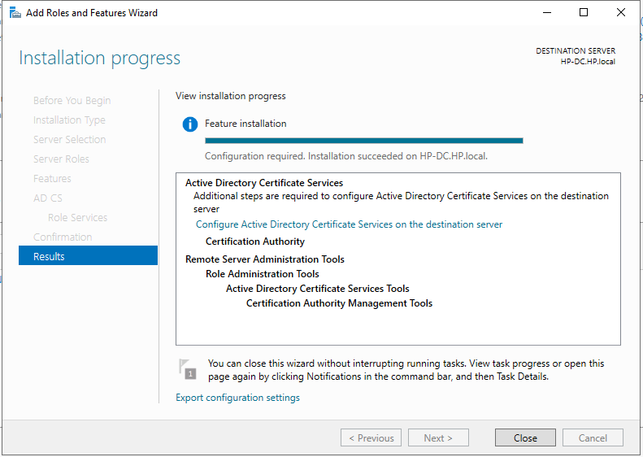

---

## 2. Configuring the Enterprise Root CA

After installation, AD CS required post-deployment configuration.

The Certificate Authority was configured as:

- Enterprise CA
- Root CA
- New private key
- RSA key length: 2048 bits
- Hash algorithm: SHA-256
- Certificate validity: 5 years

For the cryptographic configuration, I selected a 2048-bit RSA key together with SHA-256.

SHA-256 produces a 256-bit hash and provides a strong modern hashing algorithm while maintaining broad compatibility. It also avoids obsolete algorithms such as SHA-1 and MD5. The 2048-bit RSA key length was used as required by the lab and provides an appropriate balance between security and computational overhead for this environment.

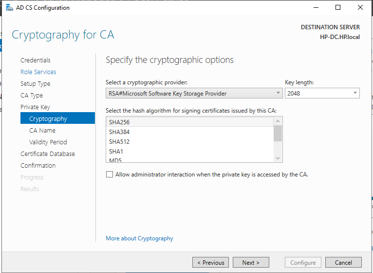

The post-deployment configuration completed successfully and the Enterprise Root CA became operational.

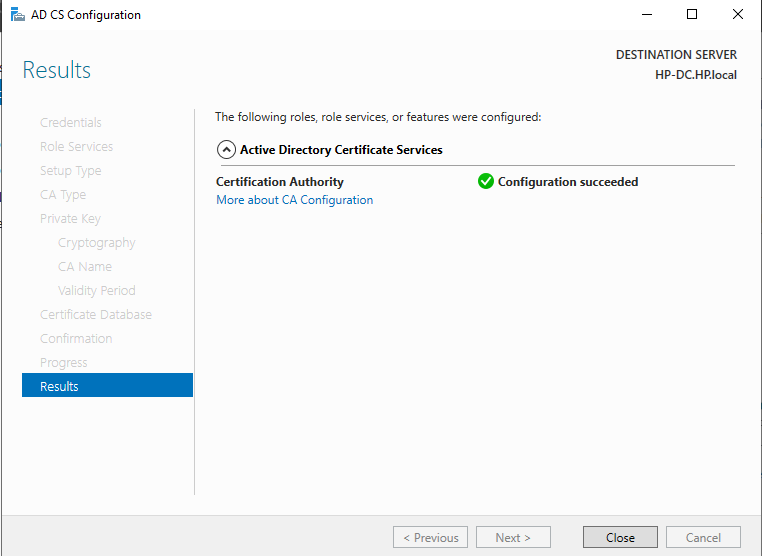

## Task 1 Outcome

The Windows Server was successfully configured as an Enterprise Root Certificate Authority capable of issuing and managing certificates for users and computers in the `HP.local` domain.

---

# Task 2 – Configure Workstation Authentication Certificates

## 3. Creating a Workstation Authentication Template

The existing `Workstation Authentication` certificate template was duplicated and customised.

The new template was named:

`ICT279 Workstation Authentication`

The template was configured with:

- Certification Authority compatibility: Windows Server 2003
- Certificate recipient compatibility: Windows XP / Server 2003
- Subject name built from Active Directory information
- Fully Distinguished Name as the subject format
- 2048-bit minimum key size

Under the Security settings, `Domain Computers` retained permission to enrol and was also granted permission to automatically enrol for certificates.

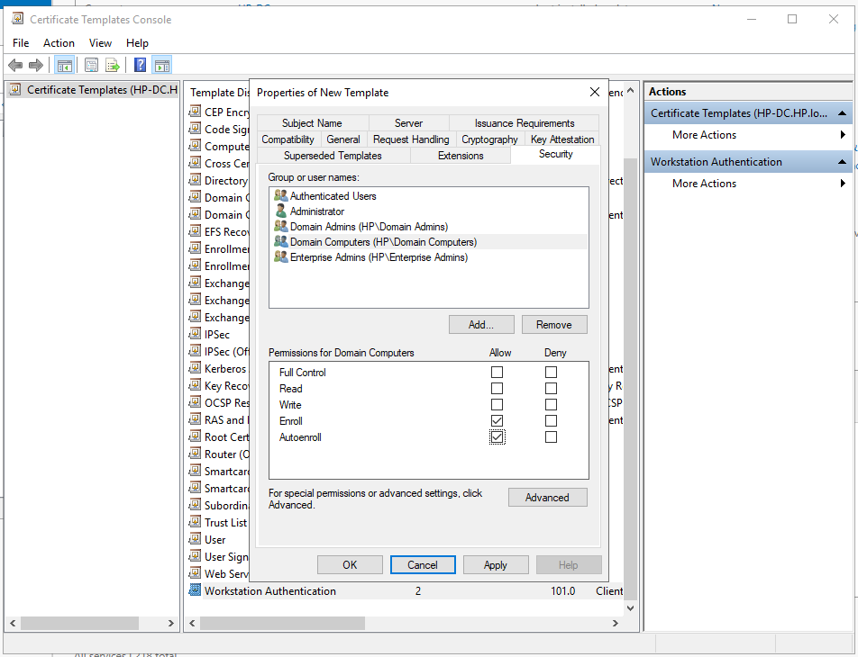

---

## 4. Issuing the Certificate Template

The custom template was then added to the Certificate Authority's issued templates.

The CA displayed `ICT279 Workstation Authentication` with the intended purpose of Client Authentication.

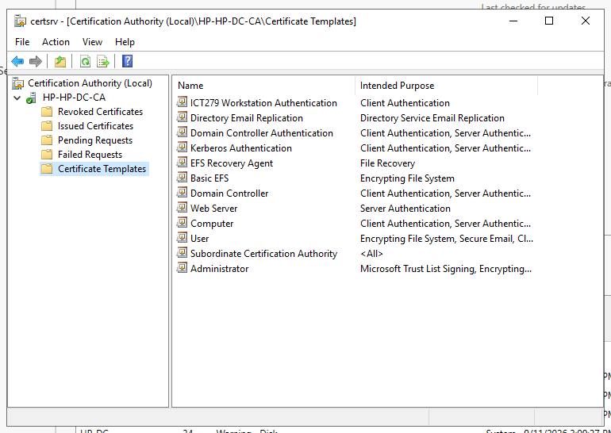

---

## 5. Updating Group Policy and Domain Replication

To make the certificate configuration available without waiting for normal domain replication, Group Policy was refreshed:

```powershell
gpupdate /force
```

Active Directory replication was also forced:

```powershell
repadmin /syncall /APeD
```

The replication completed without errors.

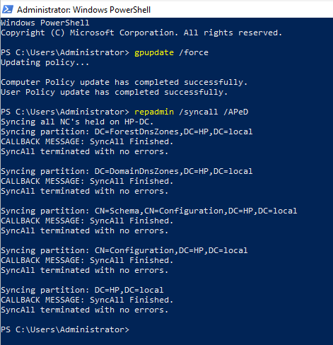

---

## 6. Verifying the Root CA on Windows 10

After updating Group Policy and rebooting the Windows 10 domain workstation, the new Root CA was visible under:

`Trusted Root Certification Authorities → Certificates`

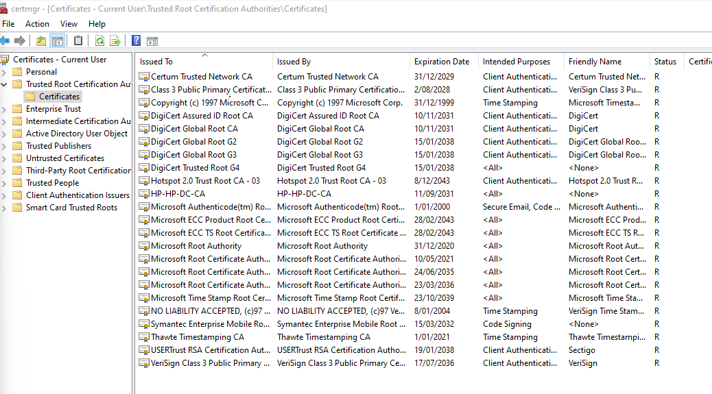

---

## 7. Enabling and Verifying Certificate Auto-Enrollment

The workstation certificate initially did not appear automatically. To complete the deployment, the Certificate Services Client Auto-Enrollment policy was enabled through Group Policy.

The policy was configured under:

`Computer Configuration → Policies → Windows Settings → Security Settings → Public Key Policies → Certificate Services Client – Auto-Enrollment`

After refreshing Group Policy and triggering certificate enrollment, Windows 10 automatically received the custom workstation certificate.

The certificate showed:

- Issued To: `WIN10`
- Issued By: `HP-HP-DC-CA`
- Intended Purpose: Client Authentication
- Template: `ICT279 Workstation Authentication`

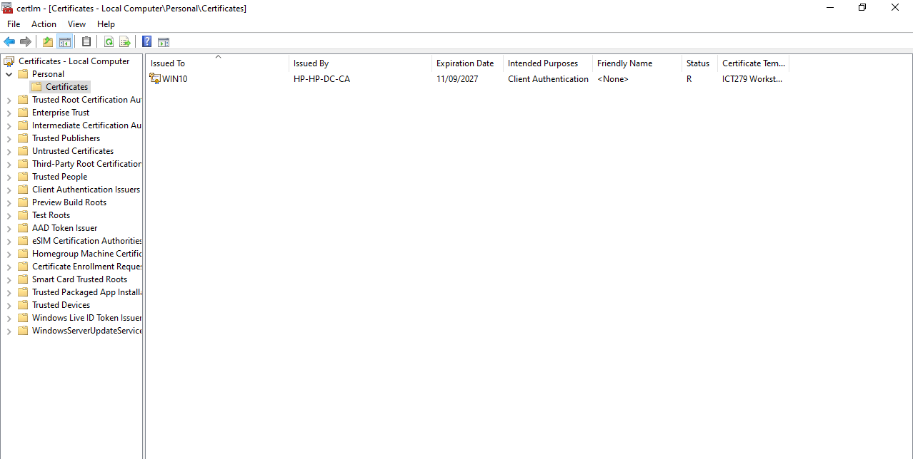

## Task 2 Outcome

A custom workstation authentication certificate template was successfully created, issued and automatically deployed to the Windows 10 domain computer.

---

# Task 3 – Create an EFS Data Recovery Agent

## 8. Creating the Recovery Certificate Template

The existing `EFS Recovery Agent` template was duplicated to create:

`ICT279 EFS Recovery Agent`

The template was configured to publish certificates in Active Directory.

Because the recovery certificate would later need to be transferred securely to another machine, the private key was configured as exportable.

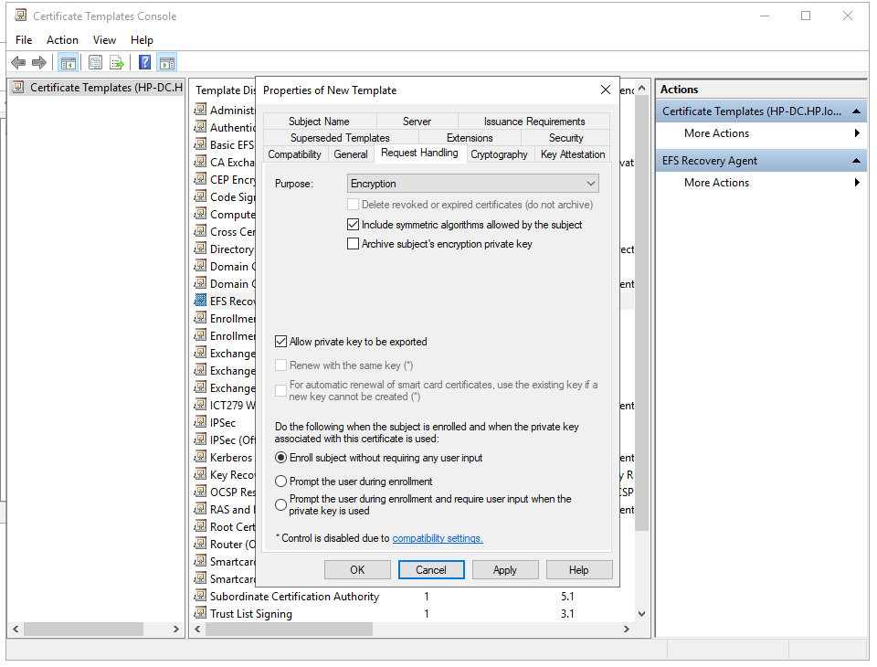

Administrator was also granted permission to enrol for the certificate.

The new recovery template was then issued through the Certificate Authority.

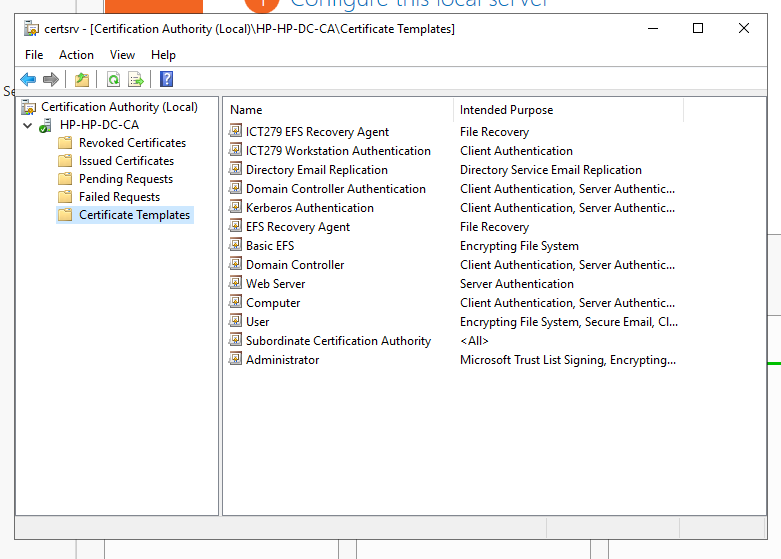

---

## 9. Enrolling Administrator for the Recovery Certificate

Administrator requested a certificate using the Active Directory Enrollment Policy.

The resulting certificate showed:

- Issued To: Administrator
- Issued By: `HP-HP-DC-CA`
- Intended Purpose: File Recovery
- Template: `ICT279 EFS Recovery Agent`

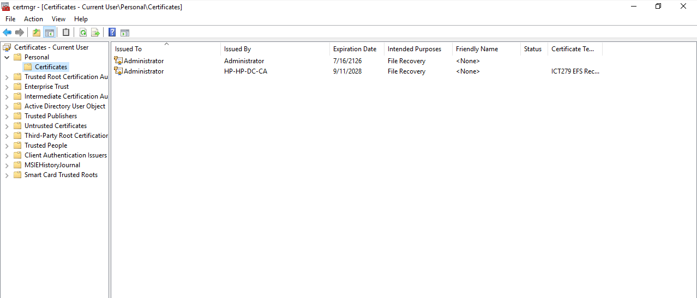

---

## 10. Configuring the EFS Data Recovery Policy

The recovery certificate was published to the Administrator Active Directory account and configured as an EFS Data Recovery Agent through Group Policy.

The policy location was:

`Computer Configuration → Policies → Windows Settings → Security Settings → Public Key Policies → Encrypting File System`

The existing default Administrator recovery agent was retained and the new `HP-HP-DC-CA` recovery certificate was added.

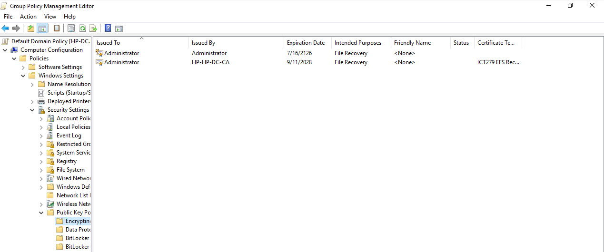

---

## 11. Exporting the Recovery Certificate and Private Key

The new recovery certificate was exported from Administrator's Personal certificate store.

The private key was included and the certificate was exported using the Personal Information Exchange (`.pfx`) format.

The PFX file was protected with a password so that possession of the file alone would not provide access to the recovery private key.

The private key remained installed on the server after the export.

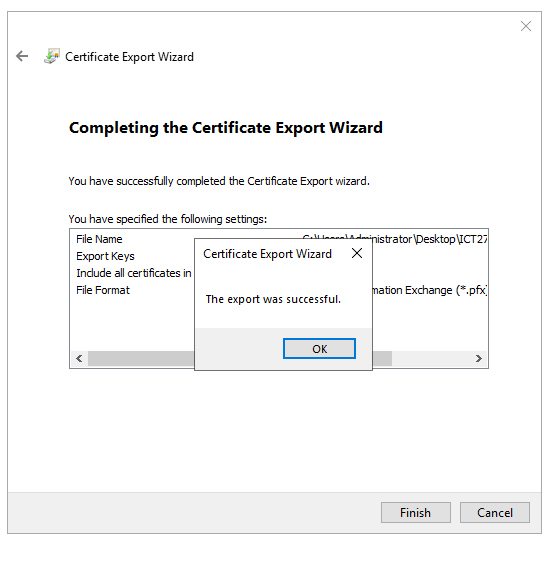

## Task 3 Outcome

A custom EFS Data Recovery Agent was successfully created and deployed. Administrator possessed a recovery certificate issued by the Enterprise CA, and the associated private key was securely exported in password-protected PFX format for use during recovery.

---

# Task 4 – Recover an EFS-Encrypted File

## 12. Creating the EFS-Encrypted Test File

A normal domain user, `A.bilal@HP.local`, created and encrypted a confidential text file using EFS.

The EFS access details showed the encrypting user together with two recovery certificates defined by domain recovery policy.

One of the recovery certificate thumbprints began with:

`9360DFFA...`

This matched the custom `ICT279 EFS Recovery Agent` certificate created during the lab.

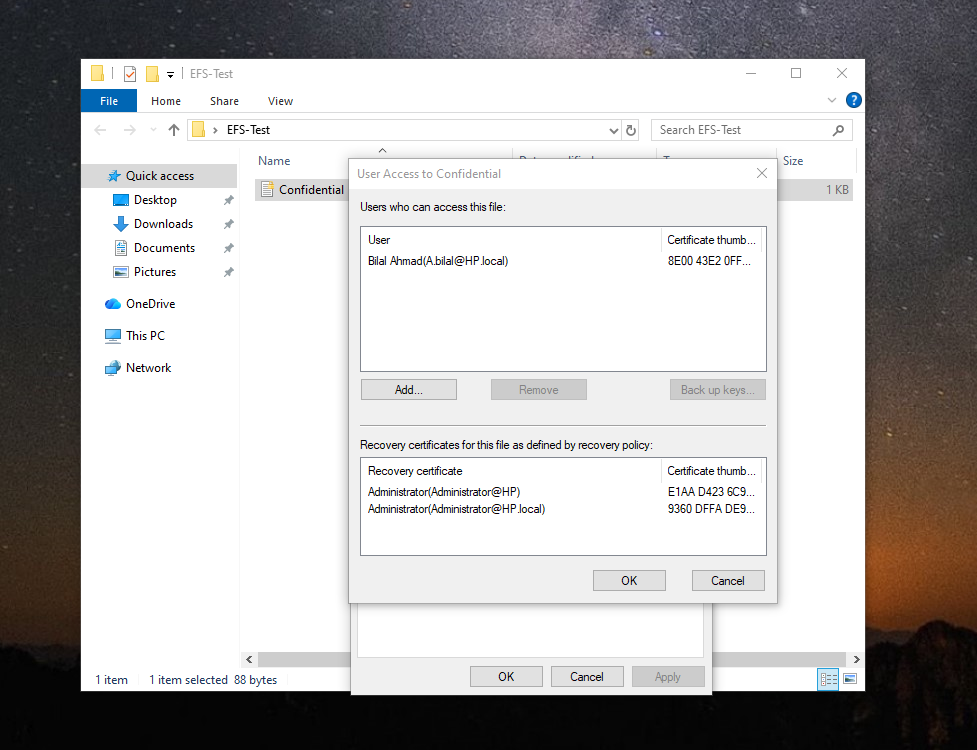

---

## 13. Testing Administrator Access Before Importing the Recovery Key

The domain Administrator then attempted to access Bilal's encrypted file.

Before the recovery private key was installed on the Windows 10 workstation, access was denied.

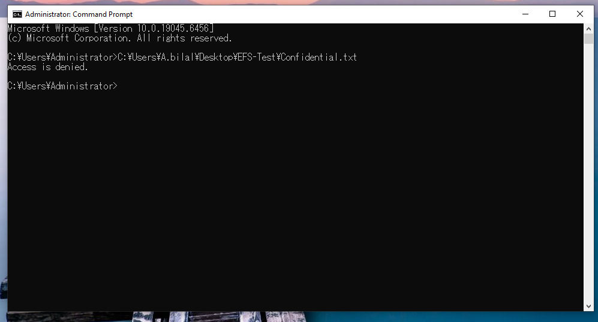

This demonstrated that administrative privileges alone were not sufficient to decrypt the EFS-protected data. The corresponding private recovery key was required.

---

## 14. Importing the Recovery Certificate

The password-protected `ICT279-EFS-Recovery.pfx` file was securely transferred from the Domain Controller to the Windows 10 workstation.

While logged in as Domain Administrator, the PFX was imported into the Administrator user's certificate store.

Windows confirmed that the certificate import completed successfully.

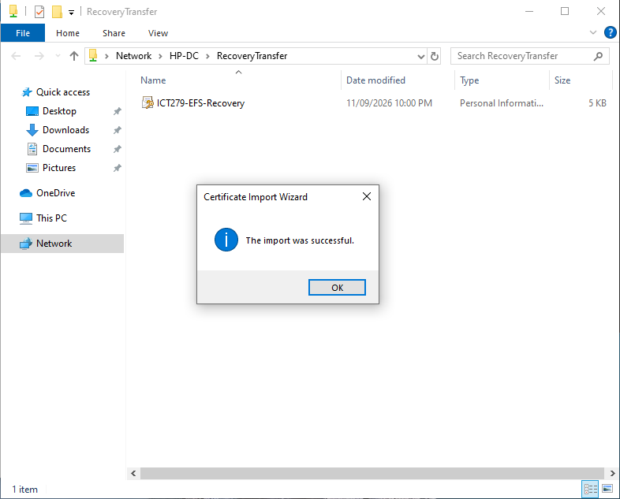

---

## 15. Recovering the Encrypted File

After the recovery certificate and its private key were imported, Administrator accessed the same EFS-encrypted file again.

This time the file was successfully decrypted and its original contents could be read:

```text
ICT279 confidential EFS recovery test.
This file was encrypted by a normal domain user.
```

The Administrator certificate store also showed the `ICT279 EFS Recovery Agent` certificate issued by `HP-HP-DC-CA`.


## Task 4 Outcome

The recovery process successfully demonstrated that an EFS-encrypted file belonging to another domain user could be recovered by an authorised Data Recovery Agent.

Administrator was unable to access the encrypted contents before possessing the appropriate recovery private key. After importing the password-protected PFX containing that key, the same Administrator account was able to decrypt and read the file.

---

# Lab Outcome

This lab demonstrated the complete certificate lifecycle within a Windows Active Directory environment.

An Enterprise Root Certificate Authority was installed using Active Directory Certificate Services. A custom Workstation Authentication certificate was created and automatically deployed to a domain computer using certificate templates and Group Policy.

A separate EFS Data Recovery Agent certificate was then created and deployed through domain recovery policy. Its private key was exported in password-protected PFX format and securely transferred to the client workstation.

The final recovery test demonstrated an important security property of EFS: being a domain administrator does not automatically provide the ability to decrypt another user's encrypted data. Recovery required possession of the private key associated with an authorised recovery certificate.

Together, these tasks demonstrated how PKI, certificate templates, Group Policy, public/private key cryptography and EFS recovery can be combined to provide centrally managed authentication and secure organisational data recovery.

