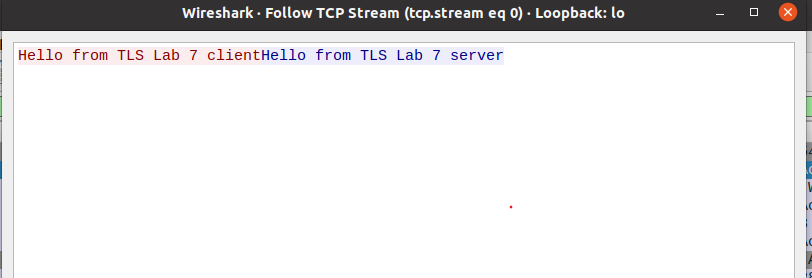
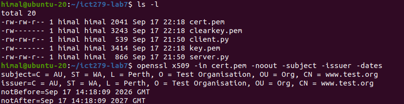
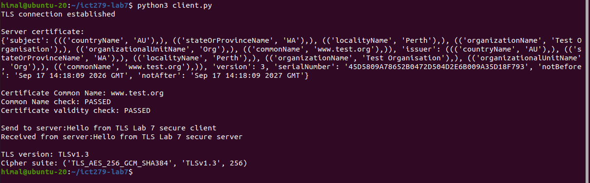
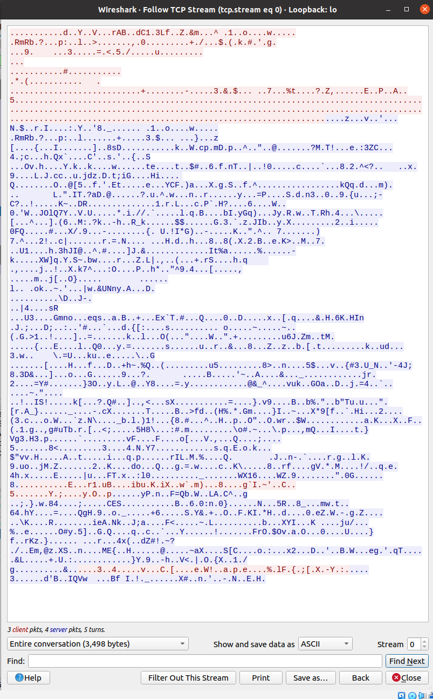
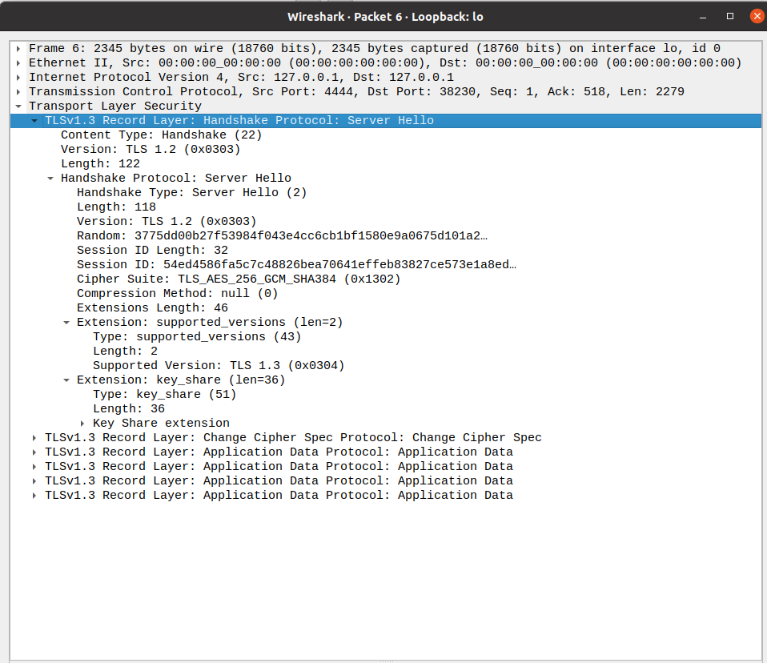
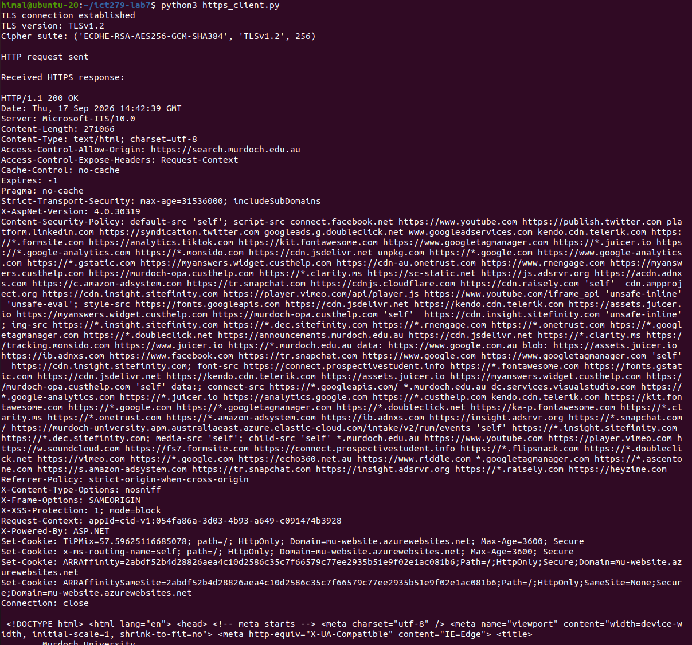

# Lab 07 – Transport Layer Security (TLS)

## Overview

This lab explored how Transport Layer Security (TLS) protects communication between a client and server.

A simple Python client and server were first implemented using normal TCP sockets. Wireshark was used to demonstrate that without encryption, the messages exchanged between the client and server could be read directly by anyone able to capture the network traffic.

The client and server were then modified to use TLS with a self-signed X.509 certificate. The client authenticated the server by verifying the certificate, checking its Common Name (CN), and confirming that the certificate was currently valid. Wireshark was then used again to demonstrate that the application data was encrypted and to inspect the TLS handshake and negotiated cipher suite.

Finally, the TLS client was modified into a simple HTTPS client and used to retrieve the Murdoch University homepage over a real TLS connection.

---

## Lab Objectives

- Implement a basic TCP client and server using Python 3.
- Observe unencrypted TCP communication using Wireshark.
- Generate a self-signed X.509 certificate using OpenSSL.
- Secure the client-server connection using TLS.
- Authenticate the server using its certificate.
- Verify the certificate Common Name and validity period.
- Confirm that TLS prevents application data from being read in a packet capture.
- Inspect the TLS handshake and negotiated cipher suite.
- Modify the TLS client to communicate with a real HTTPS server.
- Compare local TLS communication with a real-world HTTPS connection.

---

## Environment

- Ubuntu 20.04 VM
- Python 3.8.10
- Wireshark 3.2.3
- OpenSSL
- Python `socket` and `ssl` modules
- Loopback interface: `127.0.0.1`
- Local test port: `4444`

The client and server were run on the same Ubuntu VM and communicated through the loopback interface.

---

# Task 1 – Implement and Test a Simple Client and Server

## Creating the TCP Client and Server

A simple TCP client and server were implemented using Python's `socket` module.

The server listened on:

```text
IP address: 127.0.0.1
Port: 4444
```

The server created a socket, bound it to the local address, listened for incoming connections, accepted a client connection, received a message, sent a response, and closed the client connection.

The client created its own TCP socket, connected to the server, sent a message, received the server response, and closed the connection.

The test messages were:

```text
Client → Server:
Hello from TLS Lab 7 client

Server → Client:
Hello from TLS Lab 7 server
```

At this stage TLS was not being used, so the communication relied only on ordinary TCP.

## Testing the Plaintext Connection

The server was started first:

```bash
python3 server.py
```

The client was then executed in another terminal:

```bash
python3 client.py
```

The connection was successfully established and both messages were exchanged.

## Wireshark Plaintext Verification

Wireshark captured traffic from the loopback interface `lo`. The following display filter was used:

```text
tcp.port == 4444
```

The TCP conversation was inspected using **Follow → TCP Stream**.



The captured stream clearly showed:

```text
Hello from TLS Lab 7 client
Hello from TLS Lab 7 server
```

### Security Observation

This demonstrates that TCP by itself does not provide confidentiality. TCP provides reliable delivery and connection management, but the application payload remains readable. An observer capable of capturing the traffic can therefore read the exchanged messages.

---

# Task 2 – Implement and Test a TLS-Enabled Client and Server

The same client-server communication was then protected using TLS. The implementation required TLS 1.2/1.3, a server certificate, server authentication, Common Name verification, and certificate validity checking.

## Generating the Server Certificate

A self-signed X.509 certificate was generated using OpenSSL:

```bash
openssl req -x509 -newkey rsa:4096 -keyout key.pem -out cert.pem -days 365 -sha256 -subj "/C=AU/ST=WA/L=Perth/O=Test Organisation/OU=Org/CN=www.test.org"
```

This created:

```text
key.pem  – RSA private key
cert.pem – self-signed X.509 certificate
```

The certificate used a 4096-bit RSA key, SHA-256, a 365-day validity period, and the Common Name:

```text
www.test.org
```

## Creating a Passphrase-Free Server Key

A passphrase-free copy of the private key was created for the local lab server:

```bash
openssl rsa -in key.pem -out clearkey.pem
```

This prevented the server from requesting the private-key passphrase each time it started.

The private key files are intentionally excluded from this repository.

## Inspecting the Certificate

The certificate was inspected using:

```bash
openssl x509 -in cert.pem -noout -subject -issuer -dates
```

The output confirmed that the certificate used `www.test.org` as its Common Name, was currently active, had not expired, and was self-signed because the subject and issuer were identical.



The observed validity period was:

```text
notBefore = Sep 17 14:18:09 2026 GMT
notAfter  = Sep 17 14:18:09 2027 GMT
```

## Configuring the TLS Server

The server was modified to use Python's `ssl` module.

A TLS context was created:

```python
context = ssl.SSLContext(ssl.PROTOCOL_TLS)
```

The server certificate and private key were loaded:

```python
context.load_cert_chain(
    certfile="cert.pem",
    keyfile="clearkey.pem"
)
```

After accepting the normal TCP connection, the accepted client socket was wrapped with TLS:

```python
tlsConnection = context.wrap_socket(
    clientConnection,
    server_side=True
)
```

The listening socket remained a normal TCP socket, while each accepted connection was protected by TLS.

## Configuring the TLS Client

The client created its own TLS context:

```python
context = ssl.SSLContext(ssl.PROTOCOL_TLS)
context.verify_mode = ssl.CERT_REQUIRED
context.load_verify_locations("cert.pem")
```

Because the lab certificate was self-signed rather than signed by a public Certificate Authority, the client explicitly loaded `cert.pem` as a trusted certificate.

The client's TCP socket was then wrapped with TLS before communicating with the server.

## Server Certificate Authentication

After establishing the TLS connection, the client retrieved the server certificate:

```python
server_cert = tlsSocket.getpeercert()
```

The certificate was printed and then checked for the expected identity and validity period.

### Common Name Verification

The Common Name was extracted using:

```python
commonName = dict(item[0] for item in server_cert["subject"])["commonName"]
```

The expected identity was:

```text
www.test.org
```

The result was:

```text
Certificate Common Name: www.test.org
Common Name check: PASSED
```

### Certificate Validity Verification

The validity timestamps were converted using:

```python
notAfterTimestamp = ssl.cert_time_to_seconds(server_cert["notAfter"])
notBeforeTimestamp = ssl.cert_time_to_seconds(server_cert["notBefore"])
```

The current time was checked against the `notBefore` and `notAfter` values.

The result was:

```text
Certificate validity check: PASSED
```

## Successful TLS Communication

After certificate validation, the client and server exchanged messages through the protected connection:

```text
Client → Server:
Hello from TLS Lab 7 secure client

Server → Client:
Hello from TLS Lab 7 secure server
```



The local connection negotiated:

```text
TLS version: TLSv1.3
Cipher suite: TLS_AES_256_GCM_SHA384
```

## Wireshark Verification of Encryption

The TLS connection was captured using the same loopback interface and port filter:

```text
tcp.port == 4444
```

The TCP stream was followed again.



Unlike Task 1, the secure application messages were no longer visible as plaintext. Wireshark displayed TLS protocol records and encrypted data.

This demonstrated the confidentiality provided by TLS.

## Inspecting the TLS Handshake

The TLS handshake was inspected in Wireshark and the `Server Hello` message was expanded.



The Server Hello showed:

```text
Cipher Suite: TLS_AES_256_GCM_SHA384 (0x1302)
Supported Version: TLS 1.3 (0x0304)
```

Python independently confirmed that the negotiated protocol was TLS 1.3.

Wireshark also displayed a legacy `Version: TLS 1.2 (0x0303)` field in the TLS 1.3 Server Hello. The actual negotiated version was identified through the `supported_versions` extension as TLS 1.3.

## Cipher Suite

The negotiated TLS 1.3 cipher suite was:

```text
TLS_AES_256_GCM_SHA384
```

- **AES-256** provides symmetric encryption with a 256-bit key.
- **GCM** provides authenticated encryption.
- **SHA-384** is used by the TLS 1.3 cipher suite for hashing/key derivation.

---

# Task 3 – Access an HTTPS Server with the TLS Client

The TLS client was then modified to communicate with a real HTTPS server:

```text
www.murdoch.edu.au
```

using TCP port:

```text
443
```

## Using the System CA Store

Instead of trusting the lab's self-signed certificate, the client loaded Ubuntu's trusted CA certificate bundle:

```text
/etc/ssl/certs/ca-certificates.crt
```

The client used `ssl.PROTOCOL_TLS_CLIENT` and enabled hostname verification. The hostname was supplied while wrapping the socket:

```python
tlsSocket = context.wrap_socket(
    clientSocket,
    server_hostname=hostname
)
```

This allowed Python to validate the remote certificate and verify that it was appropriate for the requested hostname.

## HTTP GET Request

After the TLS connection was established, the client sent:

```http
GET / HTTP/1.1
Host: www.murdoch.edu.au
Connection: close
```

The request was transmitted through the encrypted TLS connection.

## Successful HTTPS Connection

The connection succeeded and negotiated:

```text
TLS version: TLSv1.2
Cipher suite: ECDHE-RSA-AES256-GCM-SHA384
```

The server returned:

```text
HTTP/1.1 200 OK
```

and the Murdoch University homepage HTML was successfully received.



This demonstrated that the Python TLS client could communicate securely with a real HTTPS server using the operating system's trusted CA infrastructure.

---

# Results Summary

| Test | Result |
|---|---|
| Basic TCP client/server connection | Successful |
| Plaintext visible in Wireshark | Yes |
| Self-signed certificate generated | Successful |
| Certificate CN | `www.test.org` |
| Certificate CN verification | Passed |
| Certificate validity verification | Passed |
| TLS client/server connection | Successful |
| Local TLS version | TLS 1.3 |
| Local cipher suite | `TLS_AES_256_GCM_SHA384` |
| TLS application messages readable in Wireshark | No |
| TLS handshake inspected | Successful |
| Murdoch HTTPS connection | Successful |
| Murdoch TLS version | TLS 1.2 |
| Murdoch cipher suite | `ECDHE-RSA-AES256-GCM-SHA384` |
| HTTP response | `HTTP/1.1 200 OK` |
| Murdoch homepage retrieved | Successful |

---

# Security Observations

## TCP Does Not Provide Confidentiality

The first capture showed that normal TCP does not encrypt application data. Both test messages were directly readable in Wireshark.

## TLS Protects Application Data

After TLS was introduced, the same type of application communication appeared as encrypted TLS records and the plaintext messages were no longer visible.

## TLS Also Provides Authentication

TLS does more than encrypt traffic. The local client required a trusted certificate, checked the expected Common Name, and checked the certificate validity period before exchanging application data.

## Self-Signed vs Publicly Trusted Certificates

The local server used a self-signed certificate, so the client explicitly trusted `cert.pem`.

The real HTTPS connection instead used the operating system's CA trust store, allowing the remote certificate to be validated through the normal public trust infrastructure.

## TLS Negotiation

The local connection negotiated TLS 1.3 with `TLS_AES_256_GCM_SHA384`, while the Murdoch HTTPS connection negotiated TLS 1.2 with `ECDHE-RSA-AES256-GCM-SHA384`.

This demonstrated that TLS endpoints negotiate compatible protocol versions and cryptographic parameters during connection establishment.

---

# Key Concepts Demonstrated

- Transport Layer Security (TLS)
- TCP sockets
- Python socket programming
- Python `ssl` module
- X.509 certificates
- Self-signed certificates
- Public and private keys
- Certificate Authorities and trust
- Common Name verification
- Certificate validity periods
- Server authentication
- Confidentiality and integrity
- TLS handshake
- Cipher suite negotiation
- TLS 1.2 and TLS 1.3
- HTTPS
- HTTP GET requests
- Wireshark packet analysis
- OpenSSL

---

# Repository Structure

```text
lab-07-tls/
│
├── README.md
├── screenshots/
│   ├── 01-plaintext-tcp-stream.png
│   ├── 02-self-signed-certificate-details.png
│   ├── 03-tls-client-certificate-validation.png
│   ├── 04-encrypted-tls-stream.png
│   ├── 05-tls-handshake-cipher-suite.png
│   └── 06-murdoch-https-response.png
│
└── src/
    ├── client.py
    ├── https_client.py
    └── server.py
```

---

# Source Files

## `src/server.py`

Implements the local TLS-enabled server. It listens on `127.0.0.1:4444`, accepts incoming TCP connections, wraps accepted connections with TLS, presents the server certificate, receives the client's secure message, and sends a secure response.

## `src/client.py`

Implements the local TLS-enabled client. It trusts the lab's self-signed certificate, requires certificate verification, retrieves the server certificate, checks the Common Name and validity period, exchanges protected application messages, and reports the negotiated TLS version and cipher suite.

## `src/https_client.py`

Implements the real HTTPS test. It loads Ubuntu's trusted CA bundle, performs hostname-aware TLS validation, connects to `www.murdoch.edu.au` on port 443, sends an HTTP GET request, and receives the HTTPS response.

---

# Private Key Handling

The following private-key files were generated locally during the exercise:

```text
key.pem
clearkey.pem
```

They are intentionally **not included in this repository**.

A private key represents the server's secret cryptographic material and should not be published in a public source-code repository. The certificate-generation commands are documented above so the test environment can be recreated without distributing the original private key.

---

# Learning Outcomes

By completing this lab, I gained practical experience in:

1. Building TCP client-server applications with Python.
2. Capturing and analysing TCP communication using Wireshark.
3. Demonstrating the security limitation of plaintext network communication.
4. Generating and inspecting X.509 certificates with OpenSSL.
5. Adding TLS protection to an existing TCP application.
6. Authenticating a server using certificate information.
7. Checking certificate identity and validity.
8. Identifying TLS handshakes and cipher-suite negotiation in Wireshark.
9. Comparing plaintext and encrypted network captures.
10. Using trusted CA certificates and hostname verification for real HTTPS communication.
11. Constructing a basic HTTP GET request manually.
12. Understanding how the same TLS concepts used in the local experiment apply to real HTTPS services.

---

# Conclusion

This lab demonstrated the practical security difference between ordinary TCP and TLS-protected communication.

In the initial TCP implementation, Wireshark could directly read the messages exchanged between the client and server. After TLS was introduced, the application data was encrypted and no longer visible as plaintext in the packet capture.

The self-signed certificate experiment also demonstrated the authentication role of TLS. The client did not simply establish an encrypted connection; it verified the server certificate, checked the expected Common Name, and confirmed that the certificate was within its validity period.

Inspection of the TLS handshake showed that the local connection negotiated TLS 1.3 with `TLS_AES_256_GCM_SHA384`.

Finally, the HTTPS experiment demonstrated the same principles in a real-world scenario. The Python client used the operating system's trusted CA store, performed hostname-aware certificate validation, established a TLS connection with `www.murdoch.edu.au`, sent an HTTP GET request, and successfully received an `HTTP/1.1 200 OK` response and the Murdoch University homepage.

Overall, the lab demonstrated how TLS adds confidentiality, integrity and server authentication to communication carried over TCP.
