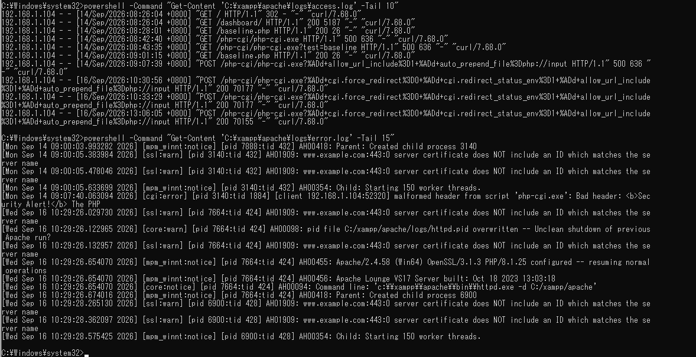
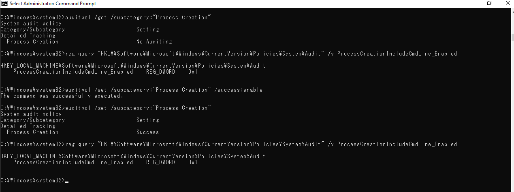
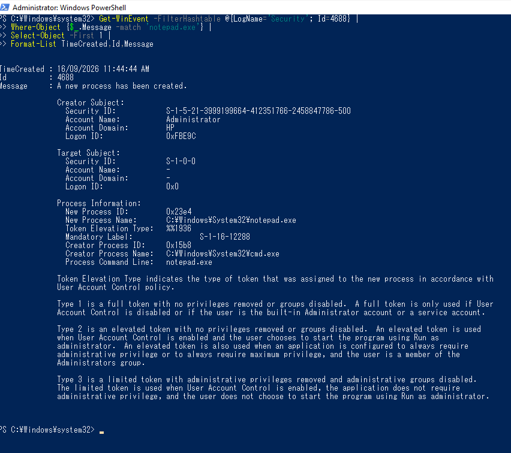
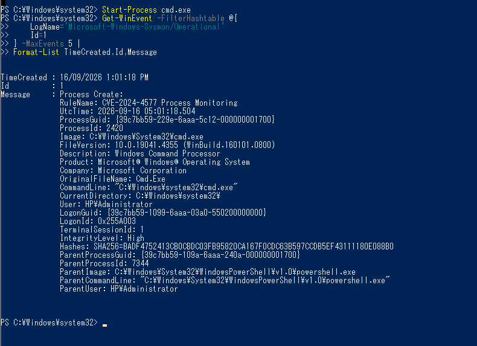
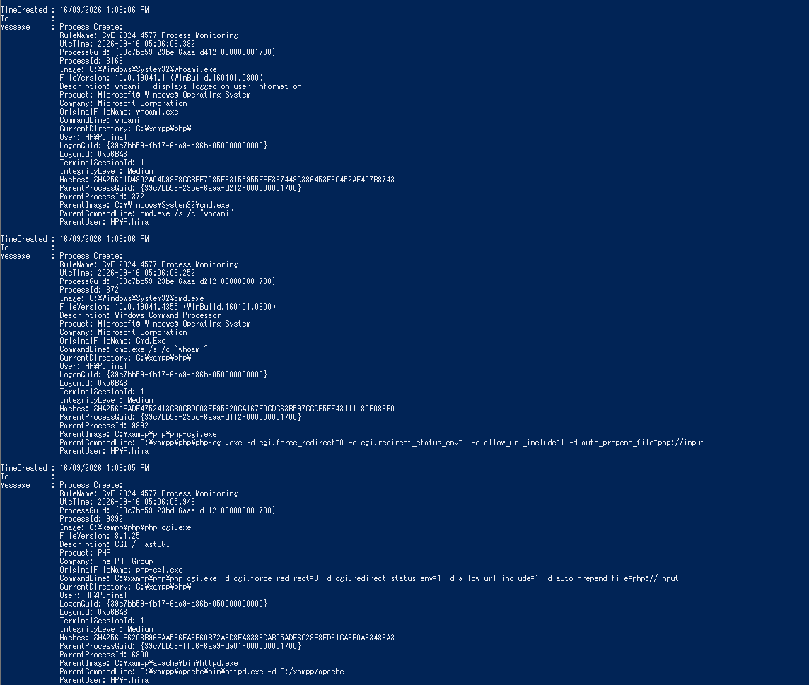
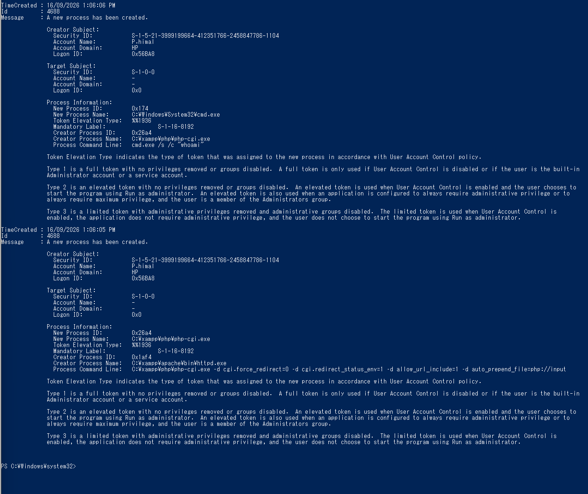
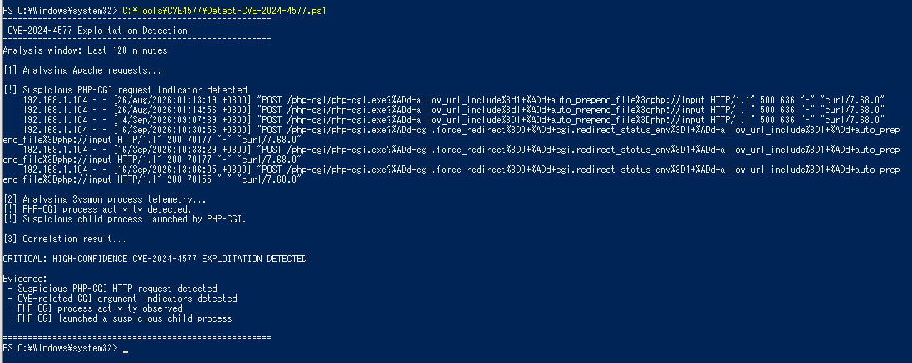
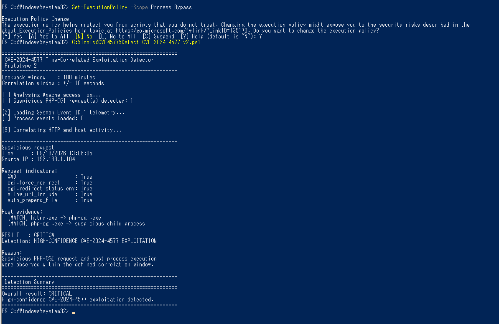

# CVE-2024-4577 Exploitation Detection Design

## Overview

This project detects actual exploitation of CVE-2024-4577 rather than only identifying a vulnerable PHP version or a suspicious HTTP request. A request containing `%AD` can indicate an attempt, but it does not prove that PHP-CGI interpreted injected arguments or that code execution occurred.

The final design therefore correlates Apache request evidence with Windows host telemetry from Security Event ID 4688 and Microsoft Sysmon Event ID 1.

## Detection Objective

The primary question is:

> Did a suspicious request targeting PHP-CGI result in abnormal execution on the Windows host?

### Request-level evidence

Apache provides:

- Source IP address
- Timestamp
- HTTP method
- Requested endpoint
- Query string
- HTTP status
- CVE-related argument indicators

### Host-level evidence

Windows telemetry provides:

- `httpd.exe` starting `php-cgi.exe`
- PHP-CGI command line
- `php-cgi.exe` creating an unexpected child process
- Process timestamps
- Parent-child relationships

This allows the detector to distinguish an attempted exploit from host-level execution.

## Why Request-Only Detection Is Insufficient

A simple signature could search for `%AD` or `/php-cgi/php-cgi.exe`. That proves suspicious input reached Apache, but not that Windows performed the relevant conversion, PHP-CGI interpreted arguments, PHP configuration changed, attacker-controlled PHP ran, or an OS process was launched.

The lab demonstrated this distinction. An early `%AD` request reached PHP-CGI but returned HTTP 500 and did not confirm attacker-controlled execution. Later testing returned HTTP 200 and confirmed PHP execution.

```text
Suspicious request != confirmed exploitation
```

## Detection Architecture

```text
HTTP request
     |
     v
Apache access/error logs
     |
     | request indicators + timestamp
     v
Correlation logic
     ^
     |
Windows host telemetry
     |
     +-- Security Event 4688
     |
     +-- Sysmon Event ID 1
             |
             v
     httpd.exe -> php-cgi.exe
             |
             v
     php-cgi.exe -> suspicious child
             |
             v
     NOTICE / WARNING / CRITICAL
```

## Apache Telemetry

The detector uses:

```text
C:\xampp\apache\logs\access.log
C:\xampp\apache\logs\error.log
```

Indicators observed during controlled testing include:

```text
/php-cgi/php-cgi.exe
%AD
cgi.force_redirect
cgi.redirect_status_env
allow_url_include
auto_prepend_file
```

The detector checks the PHP-CGI endpoint together with multiple indicators instead of treating a single `%AD` occurrence as successful exploitation.

During controlled exploitation, Apache recorded a request from `192.168.1.104` at approximately `16/Sep/2026 13:06:05`.



*Figure 1: Apache recording the controlled exploitation request.*

## Windows Security Event ID 4688

Process Creation auditing and command-line capture were enabled.

```text
Process Creation    Success
ProcessCreationIncludeCmdLine_Enabled    REG_DWORD    0x1
```



*Figure 2: Process Creation auditing and command-line capture enabled.*

A harmless `notepad.exe` test verified that Event 4688 recorded the new process, creator process and command line.



*Figure 3: Event 4688 process-creation verification.*

## Microsoft Sysmon

Sysmon 15.22 with schema 4.91 was installed to provide richer process telemetry. Event ID 1 supplies fields including `Image`, `CommandLine`, `ProcessGuid`, `ParentImage`, `ParentCommandLine`, `ParentProcessGuid`, user information and hashes.

### Custom Sysmon Configuration

The project-specific configuration is:

```text
../configs/sysmon/sysmon-cve-2024-4577.xml
```

It focuses on:

```text
httpd.exe
php-cgi.exe
cmd.exe
powershell.exe
whoami.exe
```

and processes whose parent is `httpd.exe` or `php-cgi.exe`.

The initial configuration combined filters with `AND`, preventing expected Process Create matches. The rule was refined to use:

```xml
<RuleGroup name="CVE-2024-4577 Process Monitoring" groupRelation="or">
```

After the change, Event ID 1 worked correctly.



*Figure 4: Custom Sysmon Process Create monitoring verified.*

## Observed Exploitation Process Chain

With telemetry enabled, the controlled test produced:

```text
httpd.exe
    |
    v
php-cgi.exe
    |
    v
cmd.exe
    |
    v
whoami.exe
```



*Figure 5: Sysmon recording the exploitation process chain.*

Windows Event 4688 independently recorded `httpd.exe -> php-cgi.exe` and `php-cgi.exe -> cmd.exe`, including:

```text
cmd.exe /s /c "whoami"
```



*Figure 6: Native Event 4688 confirming the process relationship.*

## Prototype 1

The first detector is:

```text
../scripts/Detect-CVE-2024-4577.ps1
```

It combined Apache indicators, PHP-CGI activity and suspicious child-process activity.

| Classification | Evidence | Interpretation |
|---|---|---|
| NOTICE | Suspicious PHP-CGI request | Possible attempt |
| WARNING | Request + PHP-CGI activity | Possible successful manipulation |
| CRITICAL | Request + PHP-CGI + suspicious child | High-confidence host exploitation |

Prototype 1 successfully classified the known test as CRITICAL.



*Figure 7: Prototype 1 detecting the controlled exploitation.*

### Prototype 1 Limitation

Prototype 1 searched Apache and Sysmon over broad independent ranges. An old suspicious Apache request could theoretically be correlated with unrelated recent process activity.

This limitation was documented and used to refine the design.

## Prototype 2 — Time-Correlated Detection

The refined detector is:

```text
../scripts/Detect-CVE-2024-4577-v2.ps1
```

Prototype 2 parses Apache timestamps and searches Sysmon within a `+/- 10 second` window around each suspicious request.

```text
Suspicious Apache request
        |
        | timestamp
        v
+/- 10 second window
        |
        +-- httpd.exe -> php-cgi.exe
        |
        +-- php-cgi.exe -> suspicious child
        |
        v
classification
```

For each request, it evaluates the PHP-CGI endpoint plus indicators including `%AD`, `cgi.force_redirect`, `cgi.redirect_status_env`, `allow_url_include`, and `auto_prepend_file`.

A PHP-CGI execution match requires a relationship equivalent to:

```text
Image: php-cgi.exe
ParentImage: httpd.exe
```

A high-confidence child-process match looks for command-capable children such as `cmd.exe`, `powershell.exe`, `pwsh.exe`, `wscript.exe`, or `cscript.exe`.

### Prototype 2 Result

Prototype 2 correlated the known request at `13:06:05` from `192.168.1.104` with:

```text
[MATCH] httpd.exe -> php-cgi.exe
[MATCH] php-cgi.exe -> suspicious child process
```

and reported:

```text
RESULT: CRITICAL
Detection: HIGH-CONFIDENCE CVE-2024-4577 EXPLOITATION
```



*Figure 8: Prototype 2 performing timestamp-based correlation.*

## Final Decision Model

| Evidence | Classification |
|---|---|
| No relevant indicators | No alert |
| Suspicious PHP-CGI request | NOTICE |
| Suspicious request + PHP-CGI execution | WARNING |
| Suspicious request + PHP-CGI + suspicious child | CRITICAL |

This intentionally separates attempted exploitation from confirmed host-side execution.

## Original Design Elements

The design was developed from behaviour observed directly in the laboratory rather than relying only on a public request signature.

Key design decisions were:

1. Treat suspicious HTTP input as evidence of an attempt, not proof of exploitation.
2. Correlate application evidence with host telemetry.
3. Use `httpd.exe -> php-cgi.exe` as evidence that CGI execution occurred near the request.
4. Treat `php-cgi.exe` spawning a command-capable process as stronger host evidence.
5. Use NOTICE, WARNING and CRITICAL classifications.
6. Refine Prototype 1 after identifying its broad-correlation limitation.
7. Parse Apache timestamps and use a defined correlation window in Prototype 2.
8. Retain Event 4688 as independent native validation of Sysmon evidence.

The development sequence was:

```text
Observed exploitation
        |
        v
Telemetry selection
        |
        v
Prototype 1
        |
        v
Limitation identified
        |
        v
Prototype 2
        |
        v
Time-correlated detection
```

## Practicality and Feasibility

The design uses telemetry available on the affected Windows server. Apache already generates logs, Event 4688 is native to Windows, and Sysmon is a Microsoft Sysinternals utility. The detector itself is implemented in PowerShell and does not require a SIEM for the laboratory demonstration.

This makes the approach practical as a compensating detection control while the vulnerable PHP service remains operational. The same logic could later be translated into a centralized SIEM correlation rule.

## False-Positive Considerations

Possible false positives include benign `%AD` input, administrative PHP-CGI testing, legitimate CGI execution near an unrelated suspicious request, or legitimate scripts that intentionally launch command-line tools.

The design reduces these risks by requiring multiple indicators for suspicious requests and requiring correlated host evidence for higher severity. The `+/- 10 second` window further reduces unrelated historical correlation.

## Limitations

### Static indicators

The request analysis is based on indicators observed during the lab. Different directives or encoding variations may require additional rules.

### Limited child-process list

The current child list focuses on common command-capable Windows executables. Other binaries could potentially be used after exploitation.

### Local log dependency

The detector depends on Apache and Sysmon logs being available and intact.

### Sysmon dependency

Prototype 2 currently uses Sysmon Event ID 1 for automated host correlation. Equivalent EDR or Event 4688 parsing would be required if Sysmon were unavailable.

### Fixed correlation window

The `+/- 10 second` window worked in this lab but may require tuning in another environment.

### No automated response

The detector identifies and classifies activity but does not automatically block traffic or terminate processes. Detection and mitigation are intentionally kept separate in this project.

### Laboratory scope

The implementation was validated against the project's Windows 10, Apache/XAMPP and PHP 8.1.25 environment. Production deployment would require additional testing and tuning.

## Potential Future Improvements

Future work could include:

- Automated Event 4688 parsing in the correlation engine.
- Central forwarding to the Windows Server 2019 management server.
- SIEM implementation of the correlation logic.
- Expanded child-process and encoding detection.
- Structured JSON/CSV alert output.
- Dedicated Windows Event Log alerts.
- Configurable correlation windows.
- Larger normal-traffic datasets for false-positive measurement.
- Detection of unusual network connections created by PHP-CGI children.
- Integration with an incident-response workflow.

## Detection Design Summary

The final design combines request indicators, host process relationships and temporal correlation.

```text
Suspicious HTTP request
        |
        v
Apache indicators
        |
        | timestamp correlation
        v
httpd.exe -> php-cgi.exe
        |
        v
php-cgi.exe -> suspicious child
        |
        v
CRITICAL exploitation alert
```

The key improvement over a simple signature is that the detector does not assume a suspicious request was successful. Higher-confidence classifications require evidence that the request was followed by relevant host execution.

Prototype 1 demonstrated the feasibility of the approach. Its correlation limitation was identified during testing and addressed by Prototype 2, which ties Apache and Sysmon evidence to the same time window.

## Supporting Project Files

### Sysmon configuration

```text
../configs/sysmon/sysmon-cve-2024-4577.xml
```

### Prototype 1

```text
../scripts/Detect-CVE-2024-4577.ps1
```

### Prototype 2

```text
../scripts/Detect-CVE-2024-4577-v2.ps1
```

### Related documentation

```text
vulnerability-analysis.md
test-environment.md
testing-results.md
mitigation-design.md
```
