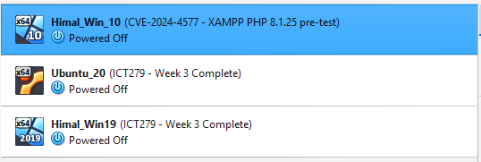

# CVE-2024-4577 Test Environment

## Overview

CVE-2024-4577 was investigated in an isolated VirtualBox laboratory environment. The environment contains three virtual machines representing a vulnerable web server, a testing machine, and a management/log collection server.

The purpose of the environment is to safely reproduce the vulnerability, observe exploitation activity, develop a custom detection method, and evaluate mitigation controls without exposing external or production systems.

## VirtualBox Lab Environment

The project uses three VirtualBox virtual machines: a Windows 10 vulnerable web server, an Ubuntu testing machine, and a Windows Server 2019 management and log collection server.



*Figure 1: VirtualBox test environment prepared for CVE-2024-4577 testing.*

## Virtual Machines

| Virtual Machine | Operating System | Role | Key Software / Purpose |
|---|---|---|---|
| Himal_Win_10 | Windows 10 | Vulnerable Web Server | XAMPP, Apache 2.4.58, PHP 8.1.25 |
| Ubuntu_20 | Ubuntu 20.04 | Testing Machine | Generates normal and controlled test traffic |
| Himal_Win19 | Windows Server 2019 | Management / Log Collection | Windows administration and log collection |

## Vulnerable Web Server

The `Himal_Win_10` virtual machine is the target system for the project.

It uses Windows 10 with XAMPP, Apache 2.4.58 and PHP 8.1.25. PHP 8.1.25 falls within the affected PHP 8.1 release range for CVE-2024-4577.

The system was used to:

- Host the vulnerable PHP environment.
- Confirm normal PHP functionality.
- Receive controlled CVE-2024-4577 test requests.
- Generate Apache access and error logs.
- Generate Windows process telemetry.
- Test the custom detection technique.
- Test the proposed mitigation controls.

Both the standard PHP executable and PHP-CGI executable were verified:

```text
PHP 8.1.25
PHP 8.1.25 (cgi-fcgi)