# CVE-2024-4577 Testing Results

## Overview

This document records the main validation steps and results from the CVE-2024-4577 laboratory project. It provides a concise evidence trail from environment verification through exploitation, detection, mitigation, and post-mitigation validation.

Detailed technical explanations are maintained separately in:

- `test-environment.md`
- `vulnerability-analysis.md`
- `detection-design.md`
- `mitigation-design.md`

---

## Test Environment Summary

| System | IP Address | Role |
|---|---|---|
| Windows 10 | `192.168.1.101` | Vulnerable XAMPP / Apache / PHP-CGI server |
| Ubuntu 20.04 | `192.168.1.104` | Controlled testing machine |
| Windows Server 2019 | `192.168.1.100` | Management / log collection |

The vulnerable server used Apache 2.4.58 and PHP/PHP-CGI 8.1.25 on Windows with code page 932.

---

## Overall Test Matrix

| ID | Test | Expected Result | Observed Result | Status |
|---|---|---|---|---|
| T01 | VM network configuration | All systems on laboratory subnet | `192.168.1.0/24` confirmed | PASS |
| T02 | Network connectivity | Systems communicate | 0% packet loss in tested paths | PASS |
| T03 | PHP/PHP-CGI version | Vulnerable PHP release present | PHP and PHP-CGI 8.1.25 | PASS |
| T04 | Normal PHP baseline | PHP page executes normally | Baseline marker returned | PASS |
| T05 | Direct PHP-CGI request | Observe CGI behaviour | HTTP 500 / Security Alert | OBSERVED |
| T06 | Initial CVE request | Investigate exploit path | HTTP 500; execution not confirmed | NOT CONFIRMED |
| T07 | Controlled PHP execution | Supplied PHP marker executes | Marker confirmed | PASS |
| T08 | Apache exploit logging | Request recorded | Suspicious request recorded with HTTP 200 | PASS |
| T09 | Windows Event 4688 | Process creation captured | Parent/child and command lines recorded | PASS |
| T10 | Sysmon Event ID 1 | Rich process telemetry captured | Event ID 1 verified | PASS |
| T11 | OS child-process execution | Host execution observable | `httpd -> php-cgi -> cmd -> whoami` | PASS |
| T12 | Detector Prototype 1 | Correlate exploit evidence | CRITICAL alert produced | PASS |
| T13 | Prototype 1 review | Identify design limitations | Broad temporal correlation identified | REFINED |
| T14 | Detector Prototype 2 | Time-correlate evidence | CRITICAL alert within defined window | PASS |
| T15 | Apache mitigation syntax | Configuration valid | `Syntax OK` | PASS |
| T16 | Normal PHP after mitigation | Legitimate service remains available | HTTP 200 / baseline marker | PASS |
| T17 | CVE request after mitigation | Exploit request rejected | HTTP 403 Forbidden | PASS |
| T18 | Host execution after mitigation | No exploit process chain | No matching exploitation chain observed | PASS |

---

## T01–T02: Network Verification

The three virtual machines were verified on the same laboratory subnet.

Ubuntu successfully communicated with the Windows 10 vulnerable server and Windows Server 2019. Windows 10 also successfully communicated with Ubuntu.

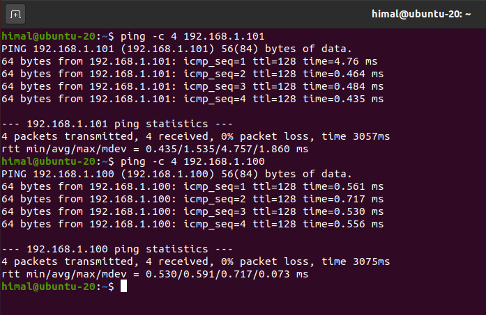

*Figure 1: Ubuntu connectivity verification.*

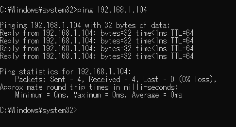

*Figure 2: Windows 10 connectivity verification.*

**Result:** PASS

---

## T03: Vulnerable PHP Version Verification

Both PHP and PHP-CGI reported version 8.1.25.

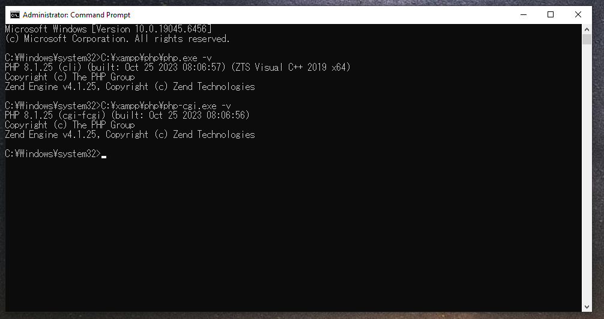

*Figure 3: PHP and PHP-CGI 8.1.25 verified.*

**Result:** PASS

---

## T04: Normal PHP Baseline

A simple PHP page was used to establish normal behaviour before exploitation testing.

Observed response:

```text
CVE Lab PHP Baseline OK
```

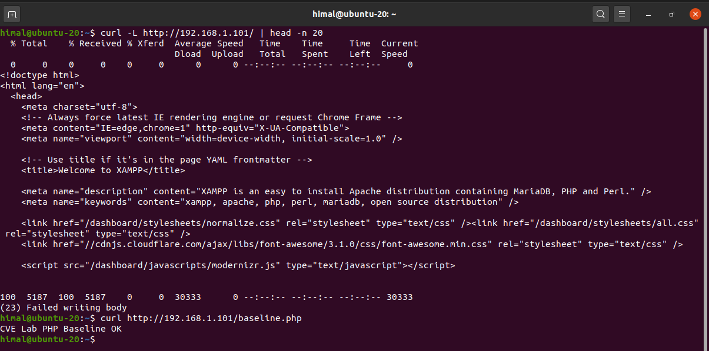

*Figure 4: Normal PHP baseline confirmed from Ubuntu.*

**Result:** PASS

---

## T05–T06: Initial PHP-CGI and CVE Testing

Direct requests to the PHP-CGI endpoint initially returned HTTP 500.

Apache recorded:

```text
malformed header from script 'php-cgi.exe'
Bad header: <b>Security Alert!</b>
```

The initial crafted CVE request was also recorded but did not confirm attacker-controlled execution.

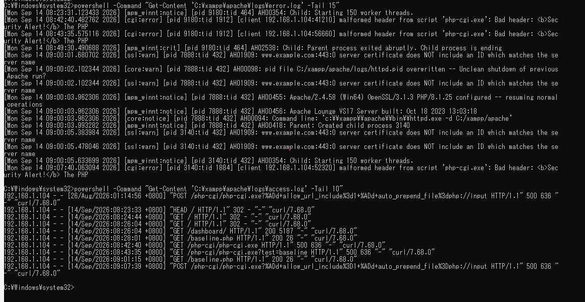

*Figure 5: Apache evidence from the initial unsuccessful exploitation attempt.*

**Result:** Exploit path reached PHP-CGI, but successful exploitation was NOT CONFIRMED.

---

## T07: Controlled PHP Execution

After the request conditions were corrected, attacker-supplied PHP was processed by PHP-CGI.

The harmless marker:

```text
CVE-2024-4577-EXECUTION-CONFIRMED
```

was found in the response.

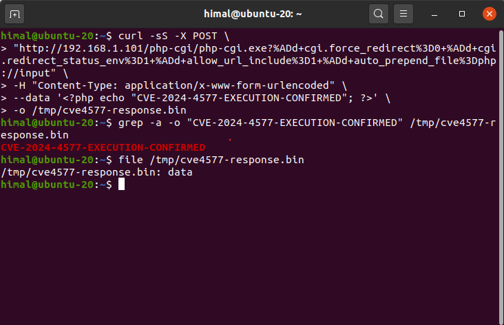

*Figure 6: Controlled attacker-supplied PHP execution confirmed.*

**Result:** PASS

---

## T08: Apache Exploitation Evidence

Apache recorded the successful controlled request with HTTP 200.

The request contained the PHP-CGI endpoint and the argument-injection indicators used during the test.

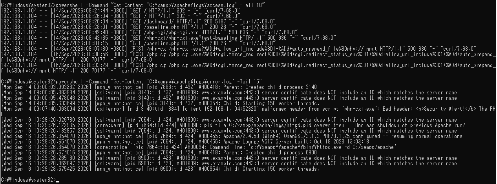

*Figure 7: Apache recording successful controlled exploitation traffic.*

**Result:** PASS

---

## T09: Windows Event 4688 Telemetry

Windows Process Creation auditing and command-line capture were enabled and verified.

During the controlled host-execution test, Event 4688 recorded:

```text
httpd.exe -> php-cgi.exe
php-cgi.exe -> cmd.exe
```

including:

```text
cmd.exe /s /c "whoami"
```


*Figure 8: Native Windows process telemetry recording the exploitation chain.*

**Result:** PASS

---

## T10–T11: Sysmon and Host Execution

Sysmon Event ID 1 was verified using the custom project configuration.

During controlled exploitation, Sysmon recorded:

```text
httpd.exe
    |
    v
php-cgi.exe
    |
    v
cmd.exe
    |
    v
whoami.exe
```


*Figure 9: Sysmon recording the exploitation process chain.*

Apache recorded the corresponding request at approximately the same time.


*Figure 10: Apache request corresponding to the host process activity.*

**Result:** PASS

---

## T12: Detection Prototype 1

The first PowerShell detector correlated suspicious Apache indicators with PHP-CGI and suspicious child-process activity.

It produced:

```text
CRITICAL:
HIGH-CONFIDENCE CVE-2024-4577 EXPLOITATION DETECTED
```


*Figure 11: Prototype 1 successfully detecting the known exploitation activity.*

**Result:** PASS

---

## T13: Prototype 1 Limitation

Review of Prototype 1 identified that Apache and Sysmon evidence were searched over broad independent ranges.

This could potentially correlate an older suspicious request with unrelated newer host activity.

**Result:** Design refinement required.

The limitation was addressed in Prototype 2.

---

## T14: Detection Prototype 2

Prototype 2 introduced Apache timestamp parsing and a defined `+/- 10 second` correlation window.

For the known exploitation event it identified:

```text
Source IP: 192.168.1.104

[MATCH] httpd.exe -> php-cgi.exe
[MATCH] php-cgi.exe -> suspicious child process

RESULT: CRITICAL
Detection: HIGH-CONFIDENCE CVE-2024-4577 EXPLOITATION
```


*Figure 12: Prototype 2 successfully performing time-based correlation.*

**Result:** PASS

---

## T15: Apache Mitigation Validation

The custom Apache mitigation configuration was syntax-checked before restart.

Observed result:

```text
Syntax OK
```

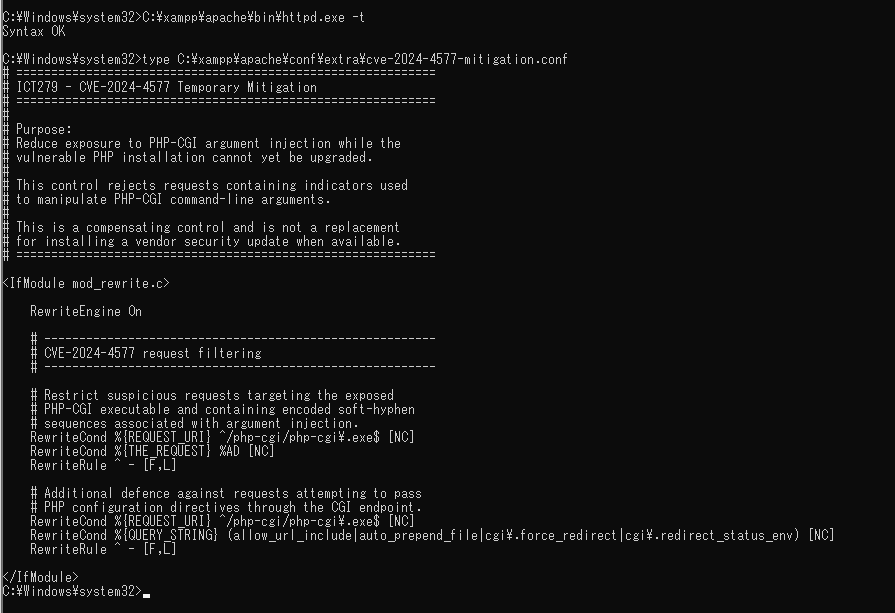

*Figure 13: Apache validating the mitigation configuration.*

**Result:** PASS

---

## T16: Normal PHP After Mitigation

The original baseline PHP page was requested after mitigation.

Observed result:

```text
HTTP 200
CVE Lab PHP Baseline OK
```

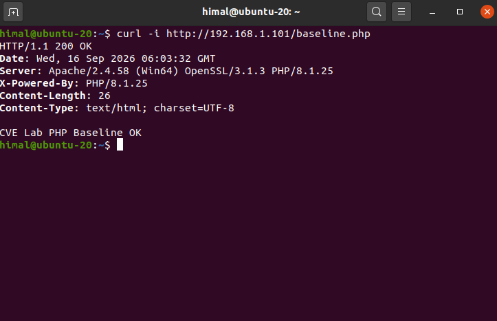

*Figure 14: Legitimate PHP functionality preserved after mitigation.*

**Result:** PASS

---

## T17: CVE Request After Mitigation

The same controlled CVE request used before mitigation was repeated.

Before mitigation:

```text
HTTP 200
```

After mitigation:

```text
HTTP/1.1 403 Forbidden
```

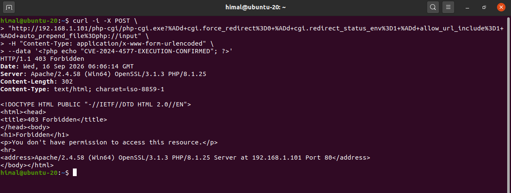

*Figure 15: Apache rejecting the controlled exploitation request after mitigation.*

**Result:** PASS

---

## T18: Host Execution After Mitigation

The blocked request was visible in Apache with HTTP 403.

A corresponding Sysmon time-window query found no matching exploitation process chain.

The earlier behaviour:

```text
php-cgi.exe -> cmd.exe -> whoami.exe
```

was not observed for the blocked request.

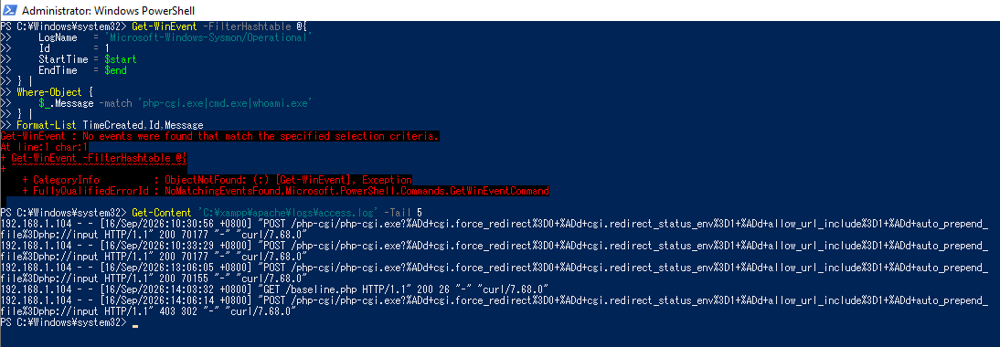

*Figure 16: Blocked request with no corresponding exploitation process chain observed.*

**Result:** PASS

---

## Before-and-After Summary

| Behaviour | Before Mitigation | After Mitigation |
|---|---|---|
| Normal PHP | HTTP 200 | HTTP 200 |
| Controlled CVE request | HTTP 200 | HTTP 403 |
| Attacker-controlled PHP | Confirmed | Not observed |
| `httpd.exe -> php-cgi.exe` exploit activity | Observed | Not observed for blocked test |
| `php-cgi.exe -> cmd.exe` | Observed | Not observed |
| `cmd.exe -> whoami.exe` | Observed | Not observed |
| Detector result for successful exploit | CRITICAL | N/A to successful host execution because request was blocked |

---

## Key Findings

1. The laboratory environment successfully reproduced CVE-2024-4577 using PHP-CGI 8.1.25 on Windows.
2. Suspicious HTTP input alone was not sufficient to prove exploitation.
3. Apache, Event 4688 and Sysmon provided complementary evidence.
4. Successful host execution produced a clear `httpd.exe -> php-cgi.exe -> cmd.exe -> whoami.exe` chain.
5. Prototype 1 demonstrated the correlation concept but had a temporal-correlation limitation.
6. Prototype 2 corrected that limitation with a `+/- 10 second` window.
7. The Apache compensating control blocked the tested CVE request with HTTP 403.
8. Normal PHP remained available after mitigation.
9. The previous exploitation process chain was not observed after the request was blocked.

---

## Supporting Artifacts

### Detection scripts

```text
../scripts/Detect-CVE-2024-4577.ps1
../scripts/Detect-CVE-2024-4577-v2.ps1
```

### Sysmon configuration

```text
../configs/sysmon/sysmon-cve-2024-4577.xml
```

### Apache mitigation

```text
../configs/apache/cve-2024-4577-mitigation.conf
```

### Detailed documentation

```text
test-environment.md
vulnerability-analysis.md
detection-design.md
mitigation-design.md
```
